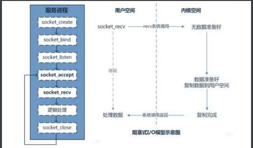
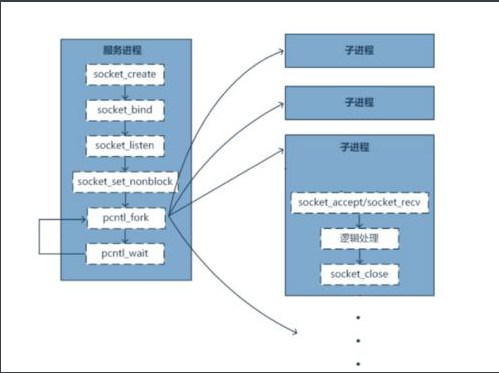
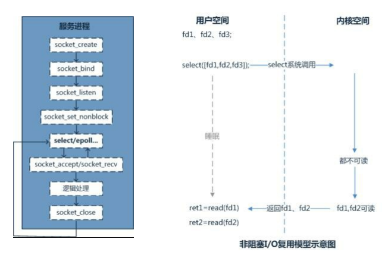
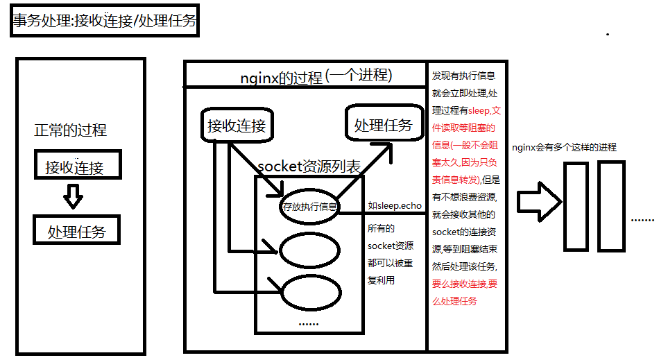
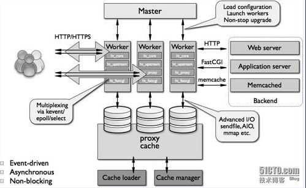
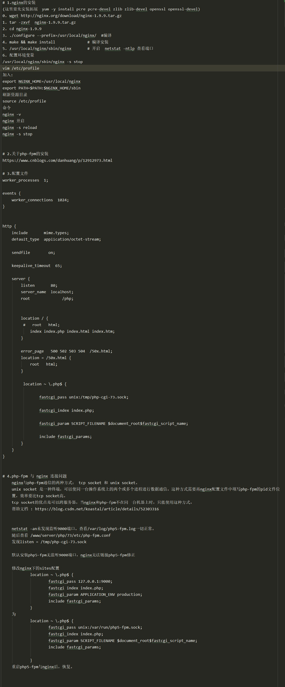
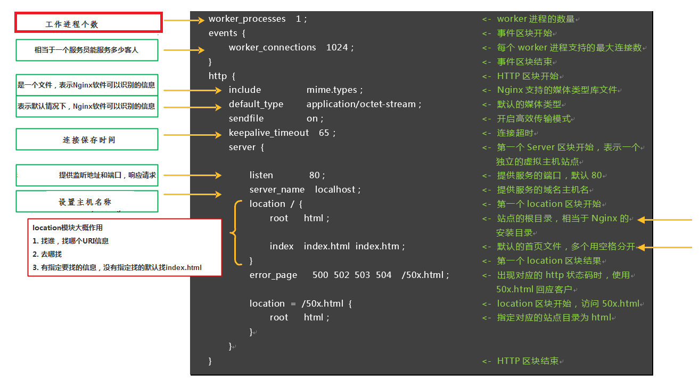
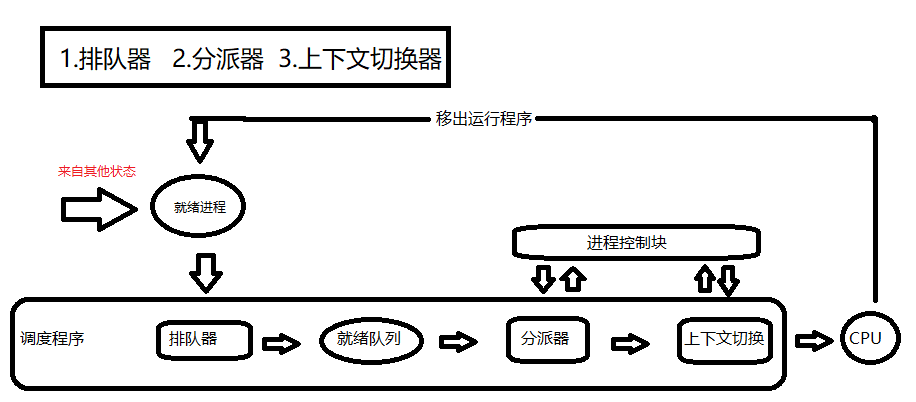

# 初识nginx
## 1.服务器的网络服务模型
关于进程和线程


web服务器和客户端是一对多的关系，Web服务器必须有能力同时为多个客户端提供服务。``一般来说完成并行处理请求工作有三种方式``

- ### 1.1 单进程阻塞的网络服务器


说明:
````
1、创建一个socket，绑定服务器端口（bind），监听端口（listen），在PHP中用stream_socket_server一个函数就能完成上面3个步骤 
2、进入while循环，阻塞在accept操作上，等待客户端连接进入。此时程序会进入睡眠状态，直到有新的客户端发起connect到服务器，操作系统会唤 醒此进程。accept函数返回客户端连接的socket 
3、利用fread读取客户端socket当中的数据收到数据后服务器程序进行处理然后使用fwrite向客户端发送响应。长连接的服务会持续与客户端交互， 而短连接服务一般收到响应就会close。
````
``缺点： 一次只能处理一个连接，不支持多个长连接同时处理``

- ###  1.2 多进程方式(预派生子进程)
>多进程方式指，服务器每当收到一个客户端请求时，就有服务器主进程生成一个子进程出来和客户端建立连接进行交互，直到连接断开该子进程就结束了。



说明：
````
前面的流程与单进程一致

程序启动后就会创建N个进程。每个子进程进入 Accept，等待新的连接进入。当客户端连接到服务器时，其中一个子进程会被唤醒，开始处理客户端 请求，并且不再接受新的TCP连接。 
当此连接关闭时，子进程会释放，重新进入 Accept，参与处理新的连接。

这个模型的优势是完全可以复用进程，不需要太多的上下文切换，比如php-fpm基于此模型来处理解析php
````
>多进程方式的优点是设计简单，各个子进程相对独立，处理客户端请求时彼此不受干扰；

缺点:``操作系统生成一个子进程需要进行内存复制等操作，在资源和时间上会产生一定的开销；当有大量请求时，会导致系统性能下降``例如：即时聊天程序，一台服务器可能要维持数十万的连接，那么就要启动数十万的进程来维持

- ### 1.3 多线程方式
>多线程方式指每当服务器接收到一个请求后，会由服务器主进程派生出一个线程出来和客户端进行交互。由于操作系统产生出一个线程的开销远远小于一个进程 的开销。故多线程方式在很大程度上减轻了Web服务器对系统资源的要求。

缺点：稳定性！假设某个进程突然关闭会造成整个进程中的所有线程都崩溃。

>基于上面的模式我们发现单个进程每次只能通过每次（accept）处理单个请求，没办法一次性连接多个请求

- ### 1.4 单进程IO复用方式


说明:
````
1、保存所有的socket,通过select模型，监听socket描述符的可读事件 
2、Select会在内核空间监听一旦发现socket可读，会从内核空间传递至用户空间，在用户空间通过逻辑判断是服务端socket可读，还是客户端 的socket可读
3、如果是服务端的socket可读，说明有新的客户端建立，将socket保留到监听数组当中 
4、如果是客户端的socket可读，说明当前已经可以去读取客户端发送过来的内容了，通过fread读取socket内容，然后fwrite响应给客户端。
````
优点：性能最好！一个进程或线程处理多个请求，不需要额外开销，性能最好，资源占用最低。 

缺点：稳定性！某个进程或线程出错，可能导致大量请求无法处理，甚至导致整个服务宕机,``单进程对于大量任务处理乏力``

- ### 1.5 多进程的master-worker IO复用方式(nginx的基本架构)

---
## 2.nginx基本架构跟进程架构,多进程异步io服务器
#### 2.1 nginx基本结构




- Nginx启动后，会产生一个主进程，主进程执行一系列的工作后会产生一个或者多个工作进程
- 在客户端请求动态站点的过程中，Nginx服务器还涉及和后端服务器的通信。Nginx将接收到的Web请求通过代理转发到后端服务器，由后端服务器进行数据处理和组织；
- Nginx为了提高对请求的响应效率，降低网络压力，采用了缓存机制，将历史应答数据缓存到本地。保障对缓存文件的快速访问

##### master进程主要用来管理worker进程，具体包括以下主要功能：
- 接收来自外界的信号。
- 处理配置文件读取。
- 创建，绑定和关闭套接字
- 启动，终止和维护配置的工作(worker)进程数
- 当woker进程退出后（异常情况下），会自动重新启动新的woker进程。


##### worker进程
>主要任务是完成具体的任务逻辑。其主要关注点是与客户端或后端真实服务器（此时nginx作为中间代理）之间的数据可读/可写等I/O交互事件。

- 接收客户端请求；
- 将请求一次送入各个功能模块进行过滤处理；
- 与后端服务器通信，接收后端服务器处理结果；
- 数据缓存
- 响应客户端请求
-

----
## 3.nginx ``模块配置`` ``配置文件`` 与 ``安装``
- [nginx中文网](https://www.nginx.cn/)
- [官方文档]( https://tengine.taobao.org/nginx_docs/cn/docs/)
- [nginx下载地址](http://nginx.org/en/download.html)

### 3.1 安装
#### 3.1.1 centos7 + nginx(1.9.9) + php


#### 3.1.2 centos8 + nginx(1.9.9) + go
````
wget http://nginx.org/download/nginx-1.9.9.tar.gz

tar -zxvf nginx-1.9.9.tar.gz

cd nginx-1.9.9

yum -y install gcc gcc-c++ pcre pcre-devel zlib zlib-devel openssl openssl-devel. // 安装依赖

// 配置nginx
./configure \
--prefix=/usr/local/nginx \
--with-http_ssl_module \
--conf-path=/usr/local/nginx/conf/nginx.conf \
--pid-path=/usr/local/nginx/conf/nginx.pid \
--lock-path=/var/lock/nginx.lock \
--error-log-path=/var/logs/nginx/error.log \
--http-log-path=/var/logs/nginx/access.log \
--with-http_gzip_static_module \
--http-client-body-temp-path=/var/temp/nginx/client \
--http-proxy-temp-path=/var/temp/nginx/proxy \
--http-fastcgi-temp-path=/var/temp/nginx/fastcgi \
--http-uwsgi-temp-path=/var/temp/nginx/uwsgi \
--http-scgi-temp-path=/var/temp/nginx/scgi


// 修改 /root/nginx-1.9.9/objs/Makefile
[root@99 objs]# pwd
/root/nginx-1.9.9/objs
[root@99 objs]# ls
Makefile  autoconf.err  nginx  nginx.8  ngx_auto_config.h  ngx_auto_headers.h  ngx_modules.c  ngx_modules.o  src
// --------------------------------------- 原来为 ---------------------------------------
CC =    cc
CFLAGS =  -pipe  -O -W -Wall -Wpointer-arith -Wno-unused -Werror -g  // 删除 -Werror -g
CPP =   cc -E
LINK =  $(CC)
// --------------------------------------- 修改为 ---------------------------------------
CC =    cc
CFLAGS =  -pipe  -O -W -Wall -Wpointer-arith -Wno-unused -Wno-implicit-fallthrough // 新增 -Wno-implicit-fallthrough
CPP =   cc -E
LINK =  $(CC)


// 修改 /root/nginx-1.9.9/src/os/unix
// --------------------------------------- 修改为 ---------------------------------------
#ifdef __GLIBC__
    /* work around the glibc bug */
   /* cd.current_salt[0] = ~salt[0];*/.   // 注释掉这一行
#endif


make && make install           ＃ 编译安装

/usr /local/nginx/sbin/nginx   #开启 netstat -ntlp 查看端口

vim /etc/profile  # 加入一下内容
export NGINX HOME=/usr/local/nginx
export PATH=$PATH:$NGINX HOME/ sbin

source /etc/profile # 刷新资源目录

命令:
nginx -V
nginx            # 开启
nginx -s reload  # 重启
nginx -S stop。  # 关闭


//---------------------------------------- 防火墙部分 ----------------------------------------------
 检查80端口是否开放：
[root@99 unix]# firewall-cmd --zone=public --list-ports // 展示所有开放端口, 如果没有 80/tcp 执行以下命令，开放端口: 

[root@99 unix]# firewall-cmd --zone=public --add-port=80/tcp --permanent // 永久开放80端口
success 

[root@99 unix]# firewall-cmd --reload  // 更新防火墙规则
success 

[root@99 unix]# firewall-cmd --zone=public --list-ports // 展示所有开放端口
80/tcp

[root@99 unix]# firewall-cmd --zone=public --remove-port=80/tcp --permanent // 永久关闭 80 端口
success

// ---------------------------------------- 利用docker配置golang服务的负载均衡 ----------------------------------------------
# goland
upstream golang {
    #ip_hash;
    server 172.16.252.99:8050 weight=3;
    server 172.16.252.99:8060 weight=3;
 }
server {
    listen       80;
    server_name  localhost;

    location / {
        root   html;
        proxy_pass   http://golang;  // 配置负载均衡的位置
        index  index.html index.htm;
    }

    error_page   500 502 503 504  /50x.html;
    location = /50x.html {
        root   html;
    }
}
//---------------------------------------- docker容器开启端口映射后，会自动在防火墙上打开端口的问题 ----------------------------------------------
方式一(临时修改)：
    ··················································
    [root@99 ~]# iptables --list
    // .........省略
    Chain DOCKER (1 references)
    target     prot opt source               destination
    ACCEPT     tcp  --  anywhere             172.17.0.2           tcp dpt:8050
    ACCEPT     tcp  --  anywhere             172.17.0.3           tcp dpt:8060
    // .........省略
    ··································································
    
    #删除DOCKER链中的1号规则；如果待删除规则不位于第一行，则将数字改为对应行号
    [root@99 ~]# iptables -D DOCKER 1
    
    #此容器只接受来自地址 172.16.252.99（主机ip） 的连接请求
    [root@99 ~]# iptables -A DOCKER -s 172.16.252.99 -d 172.17.0.2 -p tcp --sport 8050 -j ACCEPT
    [root@99 ~]# iptables -A DOCKER -s 172.16.252.99 -d 172.17.0.2 -p tcp --sport 8060 -j ACCEPT
````
### 3.2 配置文件详解
````
main （全局设置）: main 部分设置的指令将影响其它所有部分的设置；
 
http(http服务器设置) : http标准核心模块，http服务的相应配置 

server （主机设置）:
接收请求的服务器需要将不同的请求按规则转发到不同的后端服务器上，在 nginx 中我们可以通过构建虚拟主机（ server ）的概念来将这些不同的服务配置隔 离location （URL匹配特定位置后的设置）， 

location 部分用于匹配网页位置（比如，根目录“/”,“/images”,等等）, server 是对应一个域名进行的配置，而 location 是在一个域名下对更精细的路径进行配置
````


#### 配置语法说明：
````
1、配置文件由指令与指令块构成 
2、每条指令以;分号结尾，指令与参数间以空格符号分隔 3、指令块以｛｝大括号将多条指令组织在一起 
4、使用#符号添加注释，提高可读性 
5、include语句允许组合多个配置文件以提升可维护性 
6、使用$符号使用变量 
7、部分指令的参数支持正则表达式

官方文档 : https://tengine.taobao.org/nginx_docs/cn/docs/
````
#### 配置块： server
>由于IP地址的数量有限，因此经常存在多个主机域名对应着同一个IP地址的情况，这时在 nginx.conf 中就可以按照 server_name （对应用户请求中的主机域 名）并通过server块来定义虚拟主机，每个 server 块就是一个虚拟主机，它只处理与之相对应的主机域名请求。这样，一台服务器上的 Nginx 就能以不同的 方式处理访问不同主机域名的 HTTP 请求了
>
>虚拟主机名可以使用确切的名字，通配符，或者是正则表达式来定义,在开始处理一个 HTTP 请求时， Nginx 会取出 header 头中的 Host ，与每个 server 中的 server_name 进行匹配，以此决定到底由哪一个 server 块来处理这个请求。有可能一个 Host 与多个 server 块中的 server_name 都匹配，这时就会根据匹配 优先级来选择实际处理的 server 块。
``注意：优先级问题，所导致的配置不生效``

server_name与Host的匹配优先级如下：
````
1）首先选择所有字符串完全匹配的server_name，如 nginx.2367.com 。 
2）其次选择通配符在前面的server_name，如 *.2367.com。 
3）再次选择通配符在后面的server_name，如nginx.2367.* 。 
4）最后选择使用正则表达式才匹配的server_name，如 ~^\.testweb\.com$ 

如果都不匹配 
1、优先选择listen配置项后有default或default_server的 
2、找到匹配listen端口的第一个server块
````
#### 配置块: location
location表达式类型
````
~ 表示执行一个正则匹配，区分大小写； 
~* 表示执行一个正则匹配，不区分大小写； 
^~ 表示普通字符匹配。使用前缀匹配。如果匹配成功，则不再匹配其他location； 
= 进行普通字符精确匹配。也就是完全匹配； 
@ 它定义一个命名的 location，使用在内部定向时，例如 error_page, try_files
````
优先级：
````
等号类型（=）的优先级最高。一旦匹配成功，则不再查找其他匹配项 
前缀普通匹配(^~)优先级次之。不支持正则表达式。使用前缀匹配，如果有多个location匹配的话，则使用表达式最长的那个 
正则表达式类型（~ ~*）的优先级次之。一旦匹配成功，则不再查找其他匹配项 
常规字符串匹配，如果有多个location匹配的话，则使用表达式最长的那个


总结:(location =) > (location 完整路径) > (location ^~ 路径) > (location ~,~* 正则顺序) > (location 部分起始路径)
````
#### 文件路径的定义：
````
以root方式设置资源路径 
    语法： root path; 
    配置块： http、server、location、if 
以alias方式设置资源路径 
    语法： alias path; 
    配置块： location 
    alias也是用来设置文件资源路径的，它与root的不同点主要在于如何解读紧跟location后面的uri参数

注意： location中使用root指令和alias指令的意义不同
    (a) root，相当于追加在root目录后面 。比如访问的是 xxx/test=>/www/test 
    (b) alias，相当于对location中的uri进行替换，比如访问的是 xxx/test，想要访问到/www/test就必须设置 alias /www/test
````
测试:
````
 location =/name {
          default_type  text/html;
          return 200 "this is will'nginx";
         }
 location /name {
          default_type text/html;
          return 200 'this is a test';
         }

优先访问 =/name ,优先级高
````
````
//这里会进行名的拼接,真正访问 http://192.168.100.146/root/时
//访问的目录为/usr/local/nginx/root
location /root {
   root /usr/local/nginx/;
}  

//访问的目录就是/usr/local/nginx/alias
location /nginx_alias{
   alias /usr/local/nginx/alias;
}

报出404的时候,说明配置没有问题,只是指定的页面没有找到
````
通过引入外部文件
````
1.在 /usr/local/nginx/conf下创建 vhost文件夹
2.在vhost文件夹下创建 test1.com.conf 和 test2.com.conf 文件
server {
listen 8000;
    server_name test1.com;
    location / {
     default_type text/html;
    return 200 "this is test 1";
}

server {
listen 8000;
    server_name test2.com;
    location / {
     default_type text/html;
    return 200 "this is test 2";
}

3.在conf下的nginx.conf中引入(主配置文件 http{...} 段中加入以下内容)
http {
    include       mime.types;
    include vhost/*.conf;  .........


4.编辑 /etc/hosts 文件(注册虚拟域名)
# vim /etc/hosts
127.0.0.1 test1.com
127.0.0.1 test2.com

5.测试:
[root@Centos conf]# curl http://test1.com:8000
test1.com
[root@Centos conf]# curl http://test2.com:8000
test2.com
````

### 3.3 常用模块详解


#### IP访问控制模块 （ http_access_module）
用来对特定IP的进行访问控制 默认是允许所有ip访问，若部分允许需定义``deny all``

````
location / { 
    deny 192.168.1.1; 
    allow 192.168.1.0/24; 
    allow 47.98.147.49; 
    deny all; 
}
````
比如可以限制某些目录下的某些文件的访问，具体可以自己组合,禁止访问所有目录下的 sql|log|txt|jar|sh|py 后缀的文件
````
location ~.*\.(sql|log|txt|jar|war|sh|py|php) { 
    deny all; 
}
````
[常用模块](https://blog.csdn.net/ymeng9527/article/details/97813929)

### 3.4 nginx常用命令
- 查看Nginx的版本号以及安装拓展：nginx  -V
- 停止 nginx -s stop(/usr/local/nginx/sbin/nginx -s stop)
- 退出 nginx -s quit(/usr/local/nginx/sbin/nginx -s quit)
- 重启加载配置 nginx -s reload(/usr/local/nginx/sbin/nginx -s reload)
- 配置文件启动 nginx  -c </path/to/config> 为 Nginx 指定一个配置文件，来代替缺省的(/usr/local/nginx/sbin/nginx -c /usr/local/nginx/conf/nginx.conf)
- nginx  -t 不运行，而仅仅测试配置文件。nginx 将检查配置文件的语法的正确性，并尝试打开配置文件中所引用到的文件。

## 3.5 nginx的优化
从软件层面提升硬件使用效率
````
增大CPU的利用率 
增大内存的利用率 
增大磁盘10的利用率
增大网络带宽的利用率
````
提升硬件规格
````
网卡：万兆网卡，例如10G、25G、40G等 
磁盘:固态硬盘 -CPU :更快的主频，更多的核心，更大的缓存,更优的架构 
内存：更快的访问速度
````
#### Nginx相关优化配置
如何增大Nginx使用CPU的有效时长

1.能够使用全部CPU资源
````
. master-worker多进程架构 
. worker进程数量应当大于等于CPU核数
````
2.Nginx进程间不做无用功浪费CPU资源
````
. worker进程不应在繁忙时，主动让出CPU 
. worker进程间不应由于争抢造成资源耗散 
. worker进程数量应当等于CPU核数 

. worker进程不应调用一些API导致主动让出CPU 
    比如使用openresty调用第三方模块
````
3.不被其他进程争抢资源
````
. 提升优先级占用CPU更长的时间 
. 减少操作系统上耗资源的非Nginx进程
````
设置worker进程的数量
>通过合理的设置worker的进程数量，提高cpu利用率,cpu设置等于或者小于核数

查看cpu核数的方法 
````
[root@localhost /]# grep "processor" /proc/cpuinfo |wc -l
1
````
为何一个CPU就可以同时运行多个进程?
````
- 宏观上并行，微观上串行 
- 把进程的运行时间分为一段段的时间片 
- OS调度系统依次选择每个进程，最多执行时间片指定的时长
````


对于任务来说分为就绪和正在运行,所有的任务会在就绪的队列中,等待cpu处理,如果cpu是1核的,每次就只能处理一个任务,并设置运行的时间,但是运行时非常快的,低于毫秒,运行后就变成了就绪的状态,所有的进程就是一个``争抢状态``,死循环时密集型的 io ,造成CPU无法释放

争抢状态演示:
````
index.php:
<?php
sleep(2);
echo 1;


[root@localhost ~]# time php index.php
1
real    0m2.046s
user    0m0.019s
sys     0m0.008s

设置2秒的睡眠,使其2秒内不会占用CPU资源
发现时间并不是 2秒 ,多了一些,2秒后,成为了就绪状态,会与其他进程抢占CPU,时隔0.04秒抢占到
````

>系统执行进程时``串行``的,只是执行速度很快,肉眼看不到,感觉时``并行``的,
>
>我们所编辑的``index.php``,以及输出的命令,都是在``用户空间``完成,通过``sleep``,``echo``的方式向``系统内核空间``发送的指令


4.减少进程间切换
````
何为进程间切换 : 是指CPU从一个进程或线程切换到另一个进程或线程 

类别 
• 主动切换 
• 被动切换 : 时间片耗尽 

减少被动切换 
增大进程优先级
````
减少被动进程间切换的配置-设置worker进程优先级
````
增大worker进程的时间片，通过设置优先级赖减入被动切换 

什么决定CPU时间片的大小? 
    在默认情况下，最小时间片是5ms，最大则有800ms 
    进程分配的CPU时间片大小也与优先级有关，优先级越高，时间片越长 

Nice静态优先级：-20 - 19 静态优先级越小越不友好则时间片越长，可以通过top程序看到
````
减少被动进程间切换的配置-为进程绑定cpu
>nginx默认是没有开启利用多核cpu的配置的。需要通过增加worker_cpu_affinity配置参数来充分利用多核cpu
>
>当CPU在运行的时候，如果一颗CPU始终固定的去运行同一个进程，当用户连接到进程的时候，用固定的CPU响应用户的请求，CPU中有缓存，就可以重复的使 用CPU中缓存的数据。如果进程一开始运行在第一颗CPU上，运行一会跑到第二颗CPU上，就意味着原来的缓存信息在第二颗CPU上无法使用，还需要重新加 载，带来资源的浪费，影响效率


## 5. 补充

