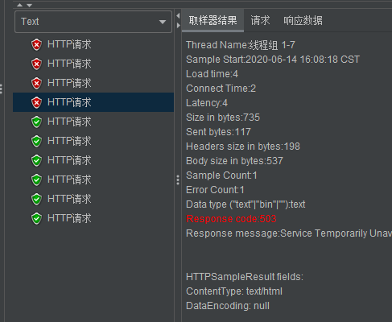
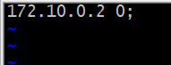
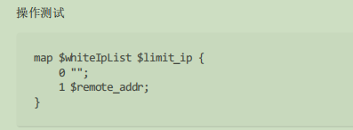
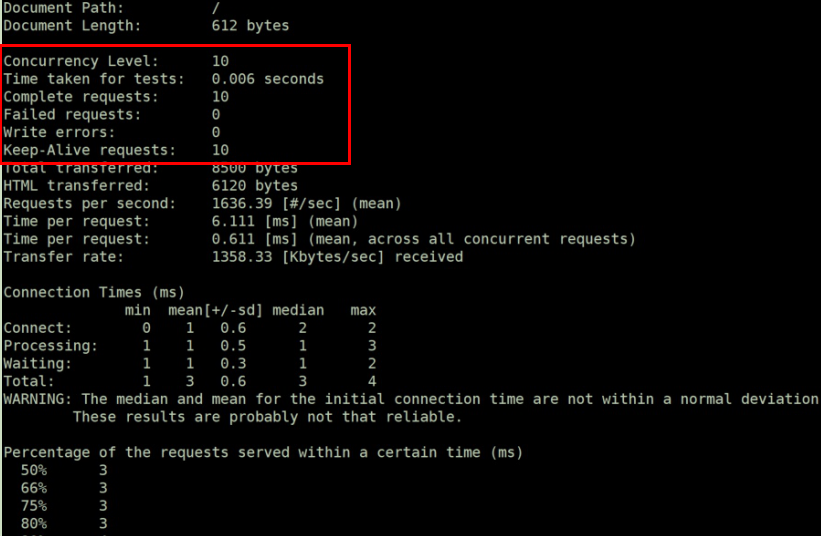

# nginx限流处理
## 1.nginx与apache的对比

>大型的高并发场景,nginx更好些,动态代理,稳定性方面,apache更好

### 1.1 nginx
- 轻量级，采用 C 进行编写，同样的 web 服务，会占用更少的内存及资源
- 抗并发，nginx 以 epoll and kqueue 作为开发模型，处理请求是异步非阻塞的，负载能力比 apache 高很多，而 apache 则是阻塞型的。在高并发下 nginx 能
保持低资源低消耗高性能 ，而 apache 在 PHP 处理慢或者前端压力很大的情况下，很容易出现进程数飙升，从而拒绝服务的现象。
- nginx 处理静态文件好，静态处理性能比 apache 高三倍以上
- nginx 的设计高度模块化，编写模块相对简单
- nginx 配置简洁，正则配置让很多事情变得简单，而且改完配置能使用 -t 测试配置有没有问题，apache 配置复杂 ，重启的时候发现配置出错了，会很崩溃
- nginx 作为负载均衡服务器，支持 7 层负载均衡
- nginx 本身就是一个反向代理服务器，而且可以作为非常优秀的邮件代理服务器
- 启动特别容易, 并且几乎可以做到 7*24 不间断运行，即使运行数个月也不需要重新启动，还能够不间断服务的情况下进行软件版本的升级
- 社区活跃，各种高性能模块出品迅速

### 1.2 apache
- apache 的 rewrite 比 nginx 强大，在 rewrite 频繁的情况下，用 apache
- apache 发展到现在，模块超多，基本想到的都可以找到
- apache 更为成熟，少 bug ，nginx 的 bug 相对较多
- apache 超稳定
- apache 对 PHP 支持比较简单，nginx 需要配合其他后端用
- apache 在处理动态请求有优势，nginx 在这方面是鸡肋，一般动态请求要 apache 去做，nginx 适合静态和反向。
- apache 仍然是目前的主流，拥有丰富的特性，成熟的技术和开发社区

### 1.3 总结
>两者最核心的区别在于 apache 是同步多进程模型，一个连接对应一个进程，而 nginx 是异步的，多个连接（万级别）可以对应一个进程
>
>一般来说，需要性能的 web 服务，用 nginx 。如果不需要性能只求稳定，更考虑 apache ，后者的各种功能模块实现得比前者，例如 ssl 的模块就比前者好，可配
置项多。epoll(freebsd 上是 kqueue ) 网络 IO 模型是 nginx 处理性能高的根本理由，但并不是所有的情况下都是 epoll 大获全胜的，如果本身提供静态服务的就只
有寥寥几个文件，apache 的 select 模型或许比 epoll 更高性能。当然，这只是根据网络 IO 模型的原理作的一个假设，真正的应用还是需要实测了再说的。

## 2. [nginx常用模块了解及使用](https://tengine.taobao.org/nginx_docs/cn/docs/)
>对于nginx的其余模块可以通过在nginx安装的时候通过./configure指定
 可以通过 ``./configure --help ``命令查看，当然有很多模块默认安装的


## 3. 限流模块
>比如：抢购的场景，下载限速下就会有涉及
>
>限流：主要是当访问量达到一个限制量的时候可以选择以服务器为主要，而选择对用户访问请求的量做限制，对于超出限制的用户请求会采取丢弃或者延迟处理等
 方式处理，来保证更多用户来访问处理。
>
>比如：某一服务器正常在高峰期上能支持的访问量是1w，但是突然某一时刻在访问量上突然暴增一下子超过3w,5w则可能会导致服务器宕机，这个时候我们
 就可以通过设置最大的访问如1分钟访问8000次
>
>也可以防止攻击（对同一个ip每秒访问多少次）如：30min/次

对应模块
````
ngx_http_limit_conn_module 限制连接数
ngx_http_limit_reg_module  限制请求
````
### 3.1 [ngx_http_limit_reg_module 限制所有请求频率](https://tengine.taobao.org/nginx_docs/cn/docs/http/ngx_http_limit_req_module.html)

>ngx_http_limit_req_module模块(0.7.21)可以通过定义的 键值来限制所有请求处理的频率。特别的，它可以限制来自单个IP地址的请求处理频率。 限制的方法是通过一种“漏桶”的方法——固定每秒处理的请求数，推迟过多的请求处理。
````
例子： limit_req_zone $binary_remote_addr zone=one:10m rate=1r/s;

Zone=one 表示设置了名为“one”，大小为10兆字节，也可以理解为设置的限流名为one rate=10r/s 的意思是允许1秒钟不超过10个请求

使用$binary_remote_addr【这是一个二进制的信息记录 $remote_addr（非二进制的）】（nginx本身存在的，保存客户端的ip地址）变量，可以将每条状态记录的
大小减少到64个字节，这样1M的内存可以保存大约1万6千个64字节的记录.如果限制域的存储空间耗尽了，对于后续所有请求，服务器都会返回 503 (Service Temporarily Unavailable)错误。

可选参数：
rate=10r/s 的意思是允许1秒钟不超过10个请求
burst=5 允许超过频率限制的请求数不多于5个，假设1、2、3、4秒请求为每秒9个，那么第5秒内请求15个是允许的，反之，如果第一秒内请求15个，会将5个请求放到第二秒，第二秒内超过10的请求直接503，类似多秒内平均速率限制
nodelay 超过的请求不被延迟处理，设置后15个请求在1秒内处
````
测试:
>这里使用jmeter进行测试
````
资料获取地址及安装教程:
链接：https://pan.baidu.com/s/1_uOk5IZmdZ1pQGtpgwERTw 
提取码：7hu2
````
测试1:
````
http {
    include       mime.types;
    default_type  application/octet-stream;
    #限制来自单个IP地址的请求处理频率
    limit_req_zone $binary_remote_addr zone=one:10m rate=1r/s;
.....


 location / {
            index index.php index.html index.htm;
             limit_req zone=one burst=5;
        }
````
>这里的``zone``跟的是事务名称,可以任意起, burst 代表允许超过频率限制的请求数不多于5个




>发现6次成功,4次失败,并且后面的五个,每秒执行一个,有延迟处理

测试2:
````
http {
    include       mime.types;
    default_type  application/octet-stream;
    #限制来自IP地址的请求数量
    limit_req_zone $binary_remote_addr zone=one:10m rate=1r/s;
.....


 location / {
            index index.php index.html index.htm;
             limit_req zone=one burst=5 nodelay;
        }
````


>加了``nodelay``参数后,没有延迟处理,依次执行完成

### 3.2 [ngx_http_limit_conn_module 限制指定IP请求次数](https://tengine.taobao.org/nginx_docs/cn/docs/http/ngx_http_limit_conn_module.html)
>ngx_http_limit_conn_module 模块可以按照定义的键限定每个键值的连接数。特别的，可以设定单一 IP 来源的连接数。并不是所有的连接都会被模块计数；只有那些正在被处理的请求（这些请求的头信息已被完全读入）所在的连接才会被计数。


测试1(限制请求次数):
````
http {
    include       mime.types;
    default_type  application/octet-stream;
    #限制来自单个IP地址的请求次数
    limit_conn_zone $binary_remote_addr zone=addr:10m;
                                                        .....
 
location / {
         #  root   html;
           index index.php index.html index.htm;
           limit_conn addr 1;
           #limit_req zone=one burst=5 nodelay;
        }
````


````
当多个 limit_conn 指令被配置时，所有的连接数限制都会生效。比如，下面配置不仅会限制单一IP来源的连接数，同时也会限制单一虚拟服务器的总连接数：

limit_conn_zone $binary_remote_addr zone=perip:10m;
limit_conn_zone $server_name zone=perserver:10m;

server {
    ...
    limit_conn perip 10;
    limit_conn perserver 100;
}
````

测试2(下载资源限速):
````
location / {
   limit_conn addr 1;
   limit_rate 10k; #限速为 10KB/秒
   autoindex on;
   # index index.php index.html index.htm;
  #limit_req zone=one burst=5 nodelay;
}
````


### 3.3 [ngx_http_access_module IP访问控制模块](https://tengine.taobao.org/nginx_docs/cn/docs/http/ngx_http_access_module.html)
>我们可以把一些ip或一些网段进行限制默认是允许所有ip访问，若部分允许需定义 deny all


## 4. [ngx_http_rewrite_module 请求重写模块](https://tengine.taobao.org/nginx_docs/cn/docs/http/ngx_http_rewrite_module.html)
>我们一直在使用,比如tp框架中的的URL重写配置,进行路径隐藏重写


>rewrite 的主要功能是实现URL地址的重定向。 Nginx 的 rewrite 功能需要PCRE软件的支持，即通过perl兼容正则表达式语句进行规则匹配的。默认参数编译
>
>nginx 就会支持 rewrite 的模块，但是也必须要PCRE的支持。

使用场景：
````
1、可以调整用户浏览的URL，看起来更规范，合乎开发及产品人员的需求。
2、为了让搜索引擎搜录网站内容及用户体验更好，企业会将动态URL地址伪装成静态地址提供服务。
3、网址换新域名后，让旧的访问跳转到新的域名上。例如，访问京东的360buy.com会跳转到jd.com
4、根据特殊变量、目录、客户端的信息进行URL调整等
````
### 4.1 if指令

### 4.2 return指令

### 4.3 Rewrite语法

### 4.4 last标记说明：


## 5. [异常页面](http://tengine.taobao.org/nginx_docs/cn/docs/http/ngx_http_core_module.html#error_page)
>nginx proxy 启用自定义错误页面：
>
>语法:proxy_intercept_errors on | off;
> 
>默认值:
>
>proxy_intercept_errors off;


测试(设置404页面):
````
http {
    include       mime.types;
    default_type  application/octet-stream;
    #设置404页面
    proxy_intercept_errors on;   #http全局块

    
                                            ...........

        server { 
                                             ..........
             error_page  404              /404.html;
             location = /404.html {
                root   html;
            }


这里需要在nginx的html下面添加404.html页面
````

````
error_page  500 503 502  /500.html;
location = /500.html {    
            root html;
        }
````
##  6.ip黑白名单
>连接限制跟请求限制，会对所有的ip进行限制，我们不希望自己的测试的ip,或者搜索引擎蜘蛛受到

根据上面的速率限制的问题：
````
limit_req_zone $binary_remote_addr zone=testz:10m rate=1r/s;
limit_conn_zone $binary_remote_addr zone=addr:10m;
````
>目前的情况是针对于所有的请求均会有做限制，而在业务中可能会存在这对于某一些ip是不做限制的需求；在nginx的配置中并不能直接对于变量编辑相应的逻辑
 计算因此我们不得不需要换一个方式

### 6.1 [ngx_http_geo_module](http://tengine.taobao.org/nginx_docs/cn/docs/http/ngx_http_geo_module.html)
>ngx_http_geo_module 模块创建变量，并根据客户端IP地址对变量赋值


测试:
````
这里使用docker容器进行测试:
环境:Alpine  安装 curl工具
 apk update && apk add curl && rm -rf /var/cache/apk/*


配置:
#设置geo
http {  .....
geo $svip {
   default         0;
   172.10.0.2      1;
 }
                     ..........
  server {           .....

location /geo {
    return 200 '$svip';
 }


访问:
(172.10.0.2)
/ # curl http://192.168.100.146:80/geo
1
(172.10.0.3)
/ #  curl http://192.168.100.146:80/geo
0
````
geo也可以引入配置文件
````
#设置geo
geo $svip {
   #default         11;
   #include      ip/svip.conf;
 }
````




### 6.2 [ngx_http_map_module](https://tengine.taobao.org/nginx_docs/cn/docs/http/ngx_http_map_module.html)



测试:
````
$remote_addr 是访问地址的ip,如果是 $binary_remote_addr ,就会成为一个压缩的二进制文件

http {  .....
 map $svip $limit_ip {
        0 $remote_addr;
        1 "";
    }
                    ..........
  server {           .....

 location /map {
            return  200  $limit_ip;
        }

访问:
(172.10.0.2)
/ # curl http://192.168.100.146:80/map
/ 
(172.10.0.3)
/ #  curl http://192.168.100.146:80/map
172.10.0.3/
````
>说明172.10.0.3不在vip范围内,要被限制
### 6.3 geo 与 map 结合使用,实现白名单操作
>修改以下``limit_req_zone $binary_remote_addr zone=limit_one:10m rate=1r/s``为`` limit_req_zone $limit_ip zone=limit_one:10m rate=1r/s;``此时就可以对IP或者IP段进行限制;

````
 http {  .....

    #限制单个ip同一时间内访问的次数
    limit_conn_zone $binary_remote_addr zone=addr:10m;

   #限制来自单个IP地址的请求处理频率
    limit_req_zone $limit_ip zone=one:10m rate=1r/s;

    #设置geo
    geo $svip {
       default         1;
       172.10.0.0      0;
     }

   #设置map
    map $svip $limit_ip {
        1 $remote_addr;
        0 "";
    }

                ..........
    server {           .....
        location / {
          index index.php index.html index.htm;
          limit_rate 1k; #限速为 10KB/秒 
          limit_req zone=one burst=5;
        }
````


>这里受到了限制


>172.10.0.2,在svip白名单里,所有访问全部成功

