# nginx常用模块（浏览器缓存及nginx缓存)
## 1.内容补充
````
1.
limit_req_zone $binary_remote_addr zone=one:10m rate=1r/s;
burst=5
关于这两项配置,表示设置了名为“one”，大小为10兆字节,rate=1/s 的意思是允许1秒钟不超过1个请求,burst=5 允许超过频率限制的请求数不多于5个，假设1、2、3
、4秒请求为每秒9个，那么第5秒内请求15个是允许的，反之，如果第一秒内请求15个,将5个请求放到第二秒，第二秒内超过10的请求直接503，类似多秒内平均速率限制

2. 
当设置了限流操作后,也就是设置了 limit_req_zone $binary_remote_addr zone=one:10m rate=1r/s; 和   limit_conn_zone $binary_remote_addr zone=addr:10m; 
此时在location中使用 return 输出,则限流操作(效果)受到影响,所以要考略下使用

3.
配置rewrite last时，请求跳出当前location，进入server块，重新进行location匹配，超过10次匹配不到报500错误。客户端的url不变
location /tp5/admin {
    rewrite ^/tp5(.*)$ /tp5/public/index.php$1 last;
}

配置rewrite break时，请求不会跳出当前location，但资源匹配会按照重写后的url进行，如果location里面配置的是proxy_pass到后端，后端服务器收到的请求url也会是重写后的url。(url重写后，直接使用当前资源，不再执行location里余下的语句，完成本次请求)客户端的url不变。
location /tp52 {
     rewrite ^/tp52(.*)$ /tp52/public/index.php$1 break;
}

配置 rewrite permanent , 永久重定向, 地址栏显示重定向后的url
location /tp {
    rewrite  http://www.baidu.com permanent;
}
至于rewrite permanent  后面的正则内容可以给,也可以不给
location /shop {
    rewrite goods/(\d+)\.html$ /tp_shop/goods.php?id=$1 permanent;
}
````
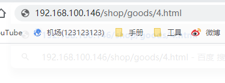
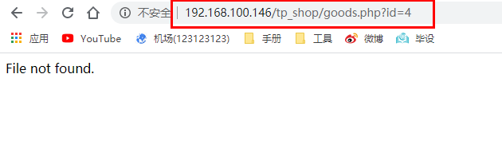
````
4.nginx中的常见错误码:
-- 302错误
302 代表暂时性转移(Temporarily Moved )。
意思就是你访问网址A，但是网址A因为服务器端的拦截器或者其他后端代码处理的原因，会被重定向到网址B。
-- 403错误
403是很常见的错误代码，一般就是未授权被禁止访问的意思。
可能的原因有两种：
Nginx程序用户无权限访问web目录文件
Nginx需要访问目录，但是autoindex选项被关闭
--502错误
Nginx 502 Bad Gateway的含义是请求的PHP-CGI已经执行，但是由于某种原因（一般是读取
资源的问题）没有执行完毕而导致PHP-CGI进程终止。一般来说Nginx 502 Bad Gateway和php-fpm.conf的设置有关。
修复方法：
    1、查看FastCGI进程是否已经启动
    ps -aux | grep php-cgi
    2、检查系统Fastcgi进程运行情况
    除了第一种情况，fastcgi进程数不够用、php执行时间长、或者是php-cgi进程死掉也可能造成Nginx的502错误。
    运行以下命令判断是否接近FastCGI进程，如果fastcgi进程数接近配置文件中设置的数值，表明worker进程数设置太少。
    netstat -anpo | grep “php-cgi” | wc -l
--504错误
Nginx 504 Gateway Time-out的含义是所请求的网关没有请求到，简单来说就是没有请求到可以执行的PHP-CGI。
Nginx 504 Gateway Time-out一般与Nginx.conf的设置有关

5.nginx设置变量:
https://www.jianshu.com/p/44680c081ea0
````
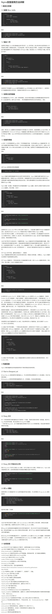

## 2.Nginx的重定向
### 2.1 nginx重写url实现伪静态
>当我们请求页面的时候,url的地址为``>goods.php?id=3``,这种方式不太美观,而且容易暴漏有效的信息,这里我们就采用了伪静态的方式,重写为``goods/3.html``
####正则表达式:
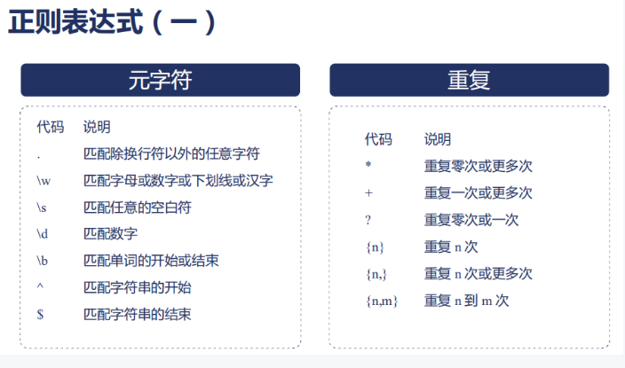
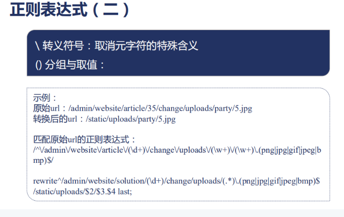

实例:
````
location /tp5/admin {
        # rewrite ^/tp5(.*)$ /tp5/public/index.php$1 last;
    }
location /tp5/public/index.php {
       #     return 200 "tp5/public/index.php/admin/order/index";
       # }
````


#### 使用正则表达式获取内容
````
获取
location /echo {
    set $user '';
    if ($http_user_agent ~ (?<user>\S+)$ ) {
    set $user "$user";
} 
    default_type text/html;
    return 200 $user;
}
````
## 3.nginx的图片防盗链
场景：某网站通过url引用了你的页面，当用户在浏览器上点击url时，http请求的头部中会通过referer头部，将该网站当前页面的url带上，告诉服务器本次请求是由这个页面发起的

目的：拒绝非正常的网站访问我们站点的 资源

思路：通过referer模块，用invalid_referer 变量根据配置判断referer头部是否合法
##### 其他服务器访问(OK的)
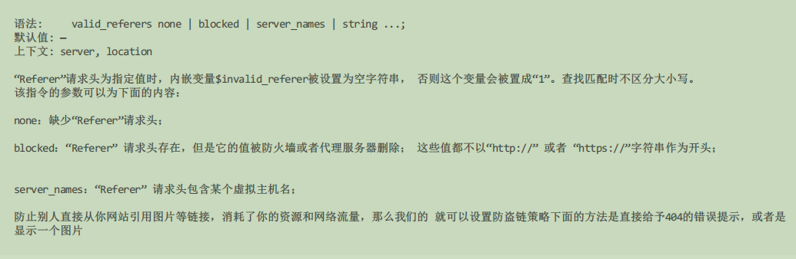
##### 本机访问(OK的)
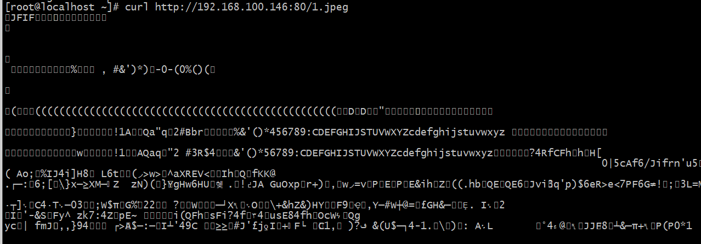

##### 设置防盗链
````
 location ~* \.(jpg|png|jpeg) {
      root /php ;
     valid_referers 192.168.100.146;
    if ( $invalid_referer ) {
        # 不是指定的头部
        return 403 "error , u have no right";
    }

}
````
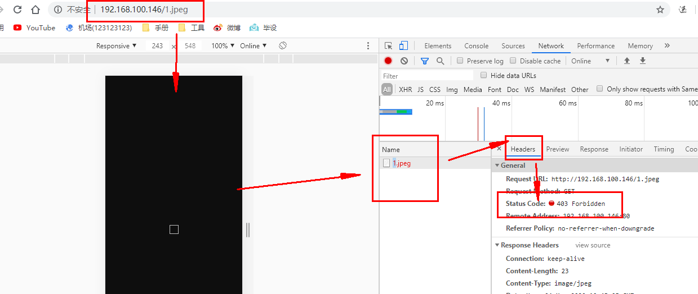
````
location ~* ^.+\.(jpg|gif|png|swf|flv|wma|wmv|asf|mp3|mmf|zip|rar)$ {
    #valid_referers none blocked www.23673.com 23673.com;
    valid_referers  192.168.100.146
    if ($invalid_referer) {
        #return 404 "您没有权限访问本站图片哟";
        #break;
         rewrite   http://192.168.100.146:80/404.png permanent;
    }
}
````
https://www.cnblogs.com/opsprobe/p/11939100.html

## 4.nginx负载均衡
>当我们的应用单例不能支撑用户请求时，此时就需要扩容，从一台服务器扩容到两台、几十台、几百台，我们需要一个入口，将客户端请求均衡分布在后台的多
 个服务器上。
>
>负载均衡在服务端开发中算是一个比较重要的特性， nginx 提供的负载均衡可以实现上游服务器的负载均衡、故障转移、失败重试、容错、健康检查，当某些
 上游服务器出现问题时，可以将请求转到其它的上游服务器从而保障高可用。

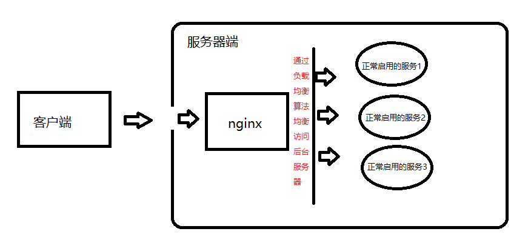

##### 类似于natapp作用
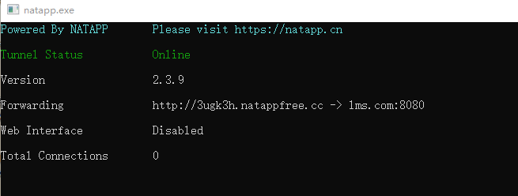

第一步我们需要给 nginx 配置上游服务器，即负载均衡到真实的处理业务的服务器 通过在 http 指令下配置 upstream 即可

指定一组上游服务器地址，其中，地址可以是域名、IP地址。可以在域名或者IP地址后加端口，如果不加端口，那么默认使用80端
````
语法: upstream name { ... }
默认值: —
上下文: http
例子：
upstream backend {
    server backend1.example.com weight=5;
    server backend2.example.com:8080;
}
server {
    location / {
        proxy_pass http://backend;
    }
}
upstream 指令当中包含server指令
语法: server address [parameters];
默认值: —
上下文: upstream


可以定义下面的参数：
--weight=number 
设定服务器的权重，默认是1，权重越大被访问机会越大，要根据机器的配置情况来配置

--max_fails=number 
设定Nginx与服务器通信的尝试失败的次数。在fail_timeout参数定义的时间段内，如果失败的次数达到此值，Nginx就认为服务器不
可用。在下一个fail_timeout时间段，服务器不会再被尝试。 失败的尝试次数默认是1。
可以通过指令proxy_next_upstream 和memcached_next_upstream来配置什么是失败的尝试。 默认配置时，http_404状态不被认为是失败的尝试。

--fail_timeout=time
统计失败尝试次数的时间段。在这段时间中，服务器失败次数达到指定的尝试次数，服务器就被认为不可用。默认情况下，该超时时间是10秒。

--backup
标记为备用服务器。当主服务器不可用以后，请求会被传给这些服务器，配置这个指令可以实现故障转移。

--down
标记服务器永久不可用，可以跟ip_hash指令一起使用。
当访问Nginx时，会将请求反向代理到backend配置的upstream server。
````
测试:
>为了方便起见,我们利用swoole设置两个http服务端
````
<?php
    $http = new Swoole\Http\Server("0.0.0.", 9501);
    $http->set([
        'worker_num'=>1,
         'daemonize' => 1
    ]);
    $http->on("start", function ($server) {
        echo "Swoole http server is started at http://127.0.0.1:9501\n";
    });

    $http->on("request", function ($request, $response) {
        $response->header("Content-Type", "text/plain");
        $response->end("Hello World\n");
    });

    $http->start();


<?php
    $http = new Swoole\Http\Server("0.0.0.0", 9502);
    $http->set([
        'worker_num'=>1,
         'daemonize' => 1
    ]);
    $http->on("start", function ($server) {
        echo "Swoole http server is started at http://127.0.0.1:9501\n";
    });

    $http->on("request", function ($request, $response) {
        $response->header("Content-Type", "text/plain");
        $response->end("Hello World\n");
    });

    $http->start();
````
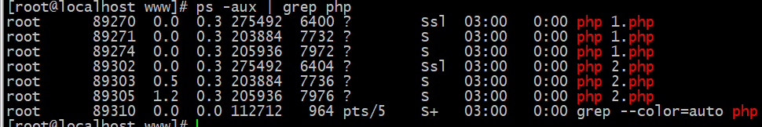
````
配置文件内容:

#负载均衡,这里的swoole_php可以任意起,但是一定要和 proxy_pass http://swoole_php中方一致
upstream swoole_php {
  server  192.168.100.138:9501;
  server  192.168.100.138:9502 ;
   #max_fails=2 fail_timeout=30s;
}
keepalive_timeout  65;
server {
    listen        80;
    server_name  localhost;
    root              /php;

    #负载均衡
    location /upstream {
        proxy_pass http://swoole_php;
     }
````
第一次刷新:

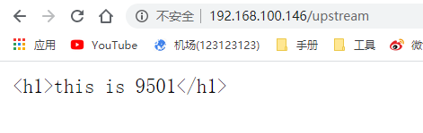

第二次刷新:


第三次刷新:

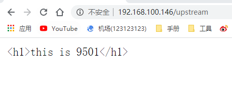

当停止一台服务

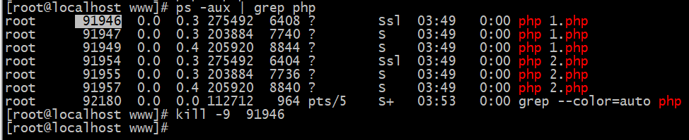

第一次刷新:


第二次刷新:


### 4.1 负载均衡的方法
#### 1、轮询
默认轮训
每一个来自网络中的请求，轮流分配给内部的服务器，从1到N然后重新开始。此种负载均衡算法适合服务器组内部的服务器都具有相同的配置并且平均服务请求相对均衡的情况
#### 2、加权轮询
通过 weight 参数控制权重
根据服务器的不同处理能力，给每个服务器分配不同的权值，使其能够接受相应权值数的服务请求。例如：服务器A的权值被设计成1，B的权值是3，C的权值是6，则服务器A、B、C将分别接受到10%、30％、60％的服务请求。此种均衡算法能确保高性能的服务器得到更多的使用率，避免低性能的服务器负载过重。
````
 upstream swoole_php {
      server  192.168.100.138:9501;
      server  192.168.100.138:9502 weight=6;
       #max_fails=2 fail_timeout=30s;
    }
````
#### 3、IP Hash
在 upstream 当中配置 ip_hash ;
这种方式通过生成请求源IP的哈希值，并通过这个哈希值来找到正确的真实服务器。这意味着对于同一主机来说他对应的服务器总是相同。使用这种方式，你不需要保存任何源IP。 将客户端会话"沾住"或者"持久化"，以便总是能选择特定服务器，那么可以使用 ip-hash 负载均衡机制。
使用 ip-hash 时，客户端IP地址作为 hash key 使用，用来决策选择服务器集群中的哪个服务器来处理这个客户端的请求。``这个方法保证从同一个客户端发起的请求总是定向到同一台服务器，除非服务器不可用``
````
  upstream swoole_php {
      server  192.168.100.138:9501  weight=2;
      server  192.168.100.138:9502  weight=1;
      ip_hash;
}

此时就会一直访问192.168.100.138:9501
````
#### 4、最少连接数
在 ``upstream`` 当中配置`` least_conn`` 实现最少连接数
客户端的每一次请求服务在服务器停留的时间可能会有较大的差异，随着工作时间加长，如果采用简单的轮循或随机均衡算法，每一台服务器上的连接进程可能会产生极大的不同，并没有达到真正的负载均衡。最少连接数均衡算法对内部中需负载的每一台服务器都有一个数据记录，记录当前该服务器正在处理的连接数量，当有新的服务连接请求时，将把当前请求分配给连接数最少的服务器，使均衡更加符合实际情况，负载更加均衡
>查看nginx源码，在http模块``ngx_http_upstream_least_conn_module.c``中，决定“最少连接”的逻辑是这样的：
````
if (best == NULL || peer->conns * best->weight < best->conns * peer->weight)
{
    best = peer; //选择peer为当前server
    many = 0;
    p = i;

} else if (peer->conns * best->weight == best->conns * peer->weight) {
    many = 1;
}
````
>``least_conn``表示选取活跃连接数与权重weight的比值最小者为下一个处理请求的server
````
upstream backend {
    least_conn;
    server 10.10.10.2 weight=2;
    server 10.10.10.4 weight=1;
    server 10.10.10.5 max_fails=2 fail_timeout=15s; #这2个一起搭配使用，表示：当失败2次的时候，就停止使30秒
    server 10.10.10.6 max_conns=250;                #最多承载250个连接
    keepalive 20;                                   # 闲置长连接缓存时间为20
}
````
重试不能无限制进行，因此，需要如下两个指令控制重试次数和重试超时
````
proxy_next_upstream_tries number：设置重试次数，默认0表示不限制，注意此重试次数指的是所有请求次数（包括第一次和之后的重试次数之和）。
proxy_next_upstream_timeout time： 设置重试最大超时时间，默认0表示不限制。即在 proxy_next_upstream_timeout 时间内允许 proxy_next_upstream_tries 次重试。如果超过了其中一个设置，则 Nginx 也会结束重试并返回客户端响应（可能是错误码)
````
配置文件
````
upstream swo_http_up {
      # ip_hash
      server  192.168.100.140:9501;
      server  192.168.100.146:9502 max_fails=2 fail_timeout=30s;
      # server  192.168.100.146:9503 weight=999;
      # server  192.168.100.146:9504;
    }
    server {
        listen       80;
        server_name  localhost;
    location /swoole {
             proxy_next_upstream timeout;   # 192.168.100.146:9502 超时
             proxy_next_upstream_tries  2;  # 设置重试次数，默认0表示不限制，注意此重试次数指的是所有请求次数（包括第一次和之后的重试次数之和）。
             proxy_next_upstream_timeout 10; # 设置重试最大超时时间，默认0表示不限制,当设置1可能体现不出效果
             proxy_read_timeout 1;          # 连接成功后，后端服务器响应时间(代理接收超时时间)
             proxy_connect_timeout 10;  # nginx连接后端的超时时间，一般不超过75s
             proxy_pass http://swo_http_up;
        }
````
当访问的时候,如果给``192.168.100.146:9501``几秒的``sleep``延迟,会出先504错误,这里出现很正常,这里与nginx的工作进程个数和cpu的核有关系

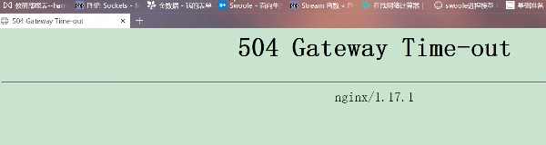

会出现两次,之后就可以正常了
````
配置文件
worker_processes  2;
worker_cpu_affinity auto;  #自动绑定cpu跟进程的关系,不设置这个参数失败次数会更多些
````


可以自定义一个error的界面来接收,转发请求


