# nginx动态负载均衡
## 1. 负载均衡补充
### 1.1 自定义hash
>需要：在项目中可能会存在于根据某一些具体的业务述职做限制；比如根据用户的id做计算然后划分到不同的服务器上；


实现方式：
- 可以通过if判断 
- 通过location转发

nginx配置文件中$request_uri到底是指的url里哪部分
````
结合在log里添加$request_uri变量，得出结论，这个$request_uri就是完整url中刨去最前面$host剩下的部分，比如http://192.168.100.146/swoole?uid=0这个url，
去掉http://192.168.100.146剩下的就是了，日志里会看到打印出来的$request_uri其实是"GET /swoole?uid=0 HTTP/1.1"。如果只访问http://192.168.100.146，$request_uri
里也会有个/的 "GET /swoole/ HTTP/1.1"。

if ($request_uri ~* "^/$") 表示url中只有域名，后面不跟任何东西，比如http://192.168.100.146

if ($request_uri ~* "test") 表示域名后面那串儿只要包含test这个关键词，就可匹配成功。比如 http://192.168.100.146/pan/beta/test3。
````
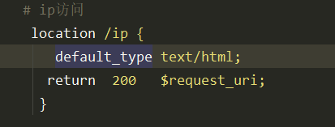


实现自定义
````
http {
sendfile on;
keepalive_timeout 65;
upstream swoole_server {
    # ip_hash;
    hash $key; # 用户id
    server 192.168.100.138:9501;
    server 192.168.100.140:9502;
    server 192.168.100.140:9503;
}
server {
# ...
    if ( $request_uri ~* ^\/.*uid=(\d+).* ) {
        set $key $1;
    }
    location /swoole_php {
        return 200 $key;
    }
    }
}
````
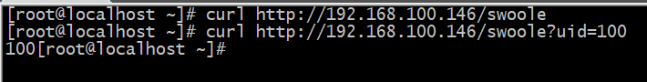

结合swoole的服务端
````
http {
sendfile on;
keepalive_timeout 65;
 upstream swoole_php {
      hash $key;
      server  192.168.100.138:9501 ;
      server  192.168.100.138:9502 ;
      server  192.168.100.138:9503 ;
    }
server {
# ...
    if ( $request_uri ~* ^\/.*uid=(\d+).* ) {
        set $key $1;
    }
    location /swoole {
        # return 200 $key;
        proxy_pass http://swoole_php;
    }
 }
}
````
通过传递的不同的uid的值访问不同的服务

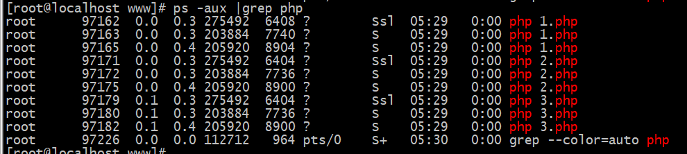


## 2.半自动平滑升级
>所谓半自动，其实就是在最后迁移的时候使用源码自带的升级命令：make upgrade 来自动完成

- 需要下载对应的需要加载的第三方的扩展，或者是需要附加设置的参数 （注意：之前的配置参数要保留）``--add_module=PATH 添加第三方扩展``
- 执行make ``不要执行 make install``
- 重命名 nginx 旧版本二进制文件，即 sbin 目录下的 nginx（期间 nginx 并不会停止服务）
- 然后``拷贝一份新编译的二进制文件到安装目录``
- 在源码目录执行 make upgrade 开始升级：

### 2.1 ``nginx``+[nginx-upsync-module](https://github.com/weibocom/nginx-upsync-module)实现配置``动态更新``
````
nginx-upsync-module
Nginx C模块，可以同步Consul或其他模块的上游。它动态地修改了后端服务器的属性（weight，max_fails等），而无需重新加载NGINX。

修改配置文件并重新启动NGINX可能并不总是很方便。例如，如果您遇到大量的流量和高负载，那时候重新启动NGINX并重新加载配置会进一步增加系统的负载并可能暂时降低性能。

该模块允许扩展和缩小而不影响性能。

另一个模块nginx-stream-upsync-module支持NGINX流模块（TCP协议），请注意。
````
- wget https://github.com/weibocom/nginx-upsync-module/archive/v2.1.0.tar.gz

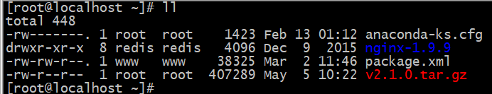

- tar -zxvf v2.1.0.tar.gz
- cd nginx-1.9.9/
- ./configure --add-module=/root/nginx-upsync-module-2.1.0
- make
- cp /usr/local/nginx/sbin/nginx /usr/local/nginx/sbin/nginx2 #备份一下原nginx的二进制文件
- mv /root/nginx-1.9.9/objs/nginx /usr/local/nginx/sbin/nginx
>mv: overwrite ‘/usr/local/nginx/sbin/nginx’? yes

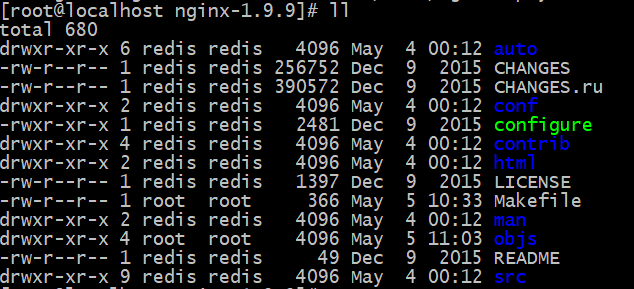

- cd ../  #到了``/root/nginx-1.9.9``目录下
-  make upgrade
````
//会报出异常
[root@localhost nginx-1.9.9]# make upgrade
/usr/local/nginx/sbin/nginx -t
nginx: the configuration file /usr/local/nginx/conf/nginx.conf syntax is ok
nginx: configuration file /usr/local/nginx/conf/nginx.conf test is successful
kill -USR2 `cat /usr/local/nginx/logs/nginx.pid`
sleep 1
test -f /usr/local/nginx/logs/nginx.pid.oldbin
make: *** [upgrade] Error 1

//查看以下Makefile 文件
[root@localhost nginx-1.9.9]# cat Makefile 

default:        build

clean:
        rm -rf Makefile objs

build:
        $(MAKE) -f objs/Makefile
        $(MAKE) -f objs/Makefile manpage

install:
        $(MAKE) -f objs/Makefile install

upgrade:
        /usr/local/nginx/sbin/nginx -t

        kill -USR2 `cat /usr/local/nginx/logs/nginx.pid`
        sleep 1
        test -f /usr/local/nginx/logs/nginx.pid.oldbin

        kill -QUIT `cat /usr/local/nginx/logs/nginx.pid.oldbin`


//说了以下与nginx.pid有关的内容,运行下net工具
[root@localhost nginx-1.9.9]# netstat -ntlp
Active Internet connections (only servers)
Proto Recv-Q Send-Q Local Address           Foreign Address         State       PID/Program name    
tcp        0      0 0.0.0.0:80              0.0.0.0:*               LISTEN      118809/nginx: maste 
````
需要值得注意的这是这里可能会报错，因为在编译之后会存在Makefile这样的文件只是，在升级的时候文件中的一行命令需要查找文件，但是在目前的版本中似乎
并不存在这个文件所导致的异常
````
[root@localhost nginx-1.9.9]# nginx -V
nginx version: nginx/1.9.9
built by gcc 4.8.5 20150623 (Red Hat 4.8.5-39) (GCC) 
configure arguments: --add-module=/root/nginx-upsync-module-2.1.0

说明安装成功
````

>平滑启动做不到100%的平滑,需要重启``worker``进程,但是``主进程``不停止运行

### 2.2 第一安装nginx,添加``nginx-upsync-module-2.1.0``

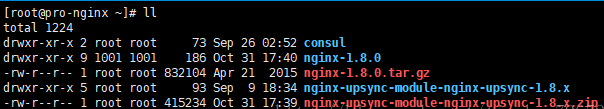
````
yum install zlib pcre pcre-devel openssl openssl-devel    zlib-devel git
cd nginx-1.8.0

./configure   --prefix=/usr/local/nginx     --with-pcre  --with-http_stub_status_module --with-http_ssl_module --with-http_gzip_static_module --with-http_realip_module --with-http_sub_module  --add-module=/root/nginx-upsync-module-nginx-upsync-1.8.x

make && make install 
````
## 3.动态负载均衡
>因为我们正常的情况就是，如果需要额外增加一台则会出现一个情况，就是它需要我们进行重启才能生效；
>
>如果在高峰期的时候去增加以及修改机器的话，默认就是修改配置文件重新加载；如果重新加载配置文件会重启worker进程 1. worker进程重启的过程会等待现有的
 请求处理完毕（需要一定的时间） 2. 重启的过程中无法处理请求-可能会造成一定的性能消耗（可能会堆积一些用户的请求无法处理）

### 3.1 运用consul处理流程
client【0】 -》 nginx(upstream xx { 【1】 }) -》consul （【2】）《- 服务（【3】）
````
【0】：客户端请求nginx 
【1】：nginx中通过脚本定期去访问consul获取服务器的信息如ip:port 
【2】：如同一个数据库记录服务器的信息
【3】：服务在启动的时候通过put向consul注册自己的信息
````
### 3.2 consul介绍
>Consul 是一个支持``多数据中心分布式`` ``高可用`` 的服务发现和``配置共享``的服务
````
consul提供的一些关键特性：
    --service discovery：consul通过DNS或者HTTP接口使服务注册和服务发现变的很容易，一些外部服务。
    --health checking：健康检测使consul可以快速的警告在集群中的操作。和服务发现的集成，可以防止请求转发到故障的服务上面。
    --key/value storage：一个用来存储动态配置的系统。提供简单的HTTP接口，可以在任何地方操作。
````
服务注册及发现实际场景
>服务注册到服务中心，当客户端请求的时候获取到健康的服务，返回健康服务的地址，客户端调用健康服务的地址 

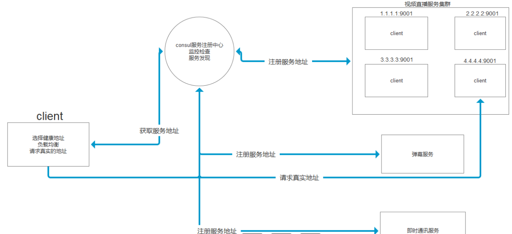

### 3.3 安装[consul](https://www.consul.io/downloads.html)
````
这是github地址：https://github.com/hashicorp/consul/releases
这是码云地址：https://gitee.com/mirrors/consul
````
- unzip consul_1.4.4_linux_amd64.zip 

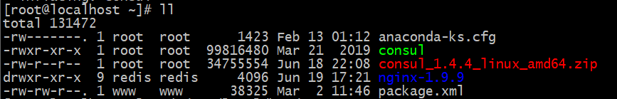
- mv   ./consul      /usr/local/bin/
- consul  #执行命令检测是否安装成功

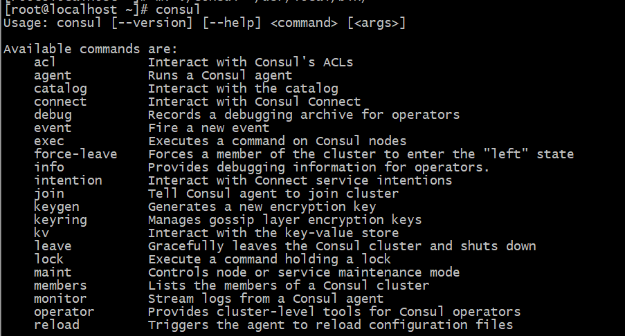
### 3.4 启动consul
>consul对外提供的端口，不同的端口有不同的作用，了解即可。


#### 启动consul服务端
````
consul agent  -server  -bootstrap-expect 1 -data-dir /tmp/consul -node=ali -bind=192.168.100.153  -ui -client=0.0.0.0

参数含义：
agent  
 -server表示启动的是一个服务
 -bootstrap-expect 1 表示等待多少个节点再启动，这里1个，就是自己一个就启动了
 --node=ali 就是给consul服务起个别名为ali_1
 -bind=172.17.114.76  绑定内网ip
 -data-dir /tmp/consul  数据存储目录为/tmp/consul
 -ui 启动默认ui界面,可以自行更改
 -client  consul绑定在哪个client地址上，这个地址提供HTTP、DNS、RPC等服务，默认是127.0.0.1，可指定允许客户端使用什么ip去访问
````
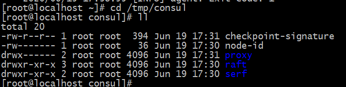

尝试启动
>consul agent  -server  -bootstrap-expect 1 -data-dir /tmp/consul -node=ali -bind=192.168.100.153  -ui -client=0.0.0.0
>
>最后加入``&``可以使后台运行
````
[root@localhost ~]# consul agent  -server  -bootstrap-expect 1 -data-dir /tmp/consul -node=ali -bind=192.168.100.153  -ui -client=0.0.0.0
BootstrapExpect is set to 1; this is the same as Bootstrap mode.
bootstrap = true: do not enable unless necessary
==> Starting Consul agent...
==> Consul agent running!
           Version: 'v1.4.4'
           Node ID: '51d17661-419c-9d18-d6ab-0cb5d7b48e6f'
         Node name: 'ali'
        Datacenter: 'dc1' (Segment: '<all>')
            Server: true (Bootstrap: true)
       Client Addr: [0.0.0.0] (HTTP: 8500, HTTPS: -1, gRPC: -1, DNS: 8600)
      Cluster Addr: 192.168.100.153 (LAN: 8301, WAN: 8302)
           Encrypt: Gossip: false, TLS-Outgoing: false, TLS-Incoming: false

==> Log data will now stream in as it occurs:

    2020/06/19 17:31:00 [INFO] raft: Initial configuration (index=1): [{Suffrage:Voter ID:51d17661-419c-9d18-d6ab-0cb5d7b48e6f Address:192.168.100.153:8300}]
    2020/06/19 17:31:00 [INFO] serf: EventMemberJoin: ali.dc1 192.168.100.153
    2020/06/19 17:31:00 [INFO] serf: EventMemberJoin: ali 192.168.100.153
    2020/06/19 17:31:00 [INFO] agent: Started DNS server 0.0.0.0:8600 (udp)
    2020/06/19 17:31:00 [INFO] raft: Node at 192.168.100.153:8300 [Follower] entering Follower state (Leader: "")
    2020/06/19 17:31:00 [WARN] serf: Failed to re-join any previously known node
    2020/06/19 17:31:00 [WARN] serf: Failed to re-join any previously known node
    2020/06/19 17:31:00 [INFO] consul: Adding LAN server ali (Addr: tcp/192.168.100.153:8300) (DC: dc1)
    2020/06/19 17:31:00 [INFO] consul: Handled member-join event for server "ali.dc1" in area "wan"
    2020/06/19 17:31:00 [WARN] agent/proxy: running as root, will not start managed proxies
    2020/06/19 17:31:00 [INFO] agent: Started DNS server 0.0.0.0:8600 (tcp)
    2020/06/19 17:31:00 [INFO] agent: Started HTTP server on [::]:8500 (tcp)
    2020/06/19 17:31:00 [INFO] agent: started state syncer
````
````
[root@localhost ~]# netstat -ntlp
Active Internet connections (only servers)
Proto Recv-Q Send-Q Local Address           Foreign Address         State       PID/Program name    
tcp        0      0 192.168.100.153:8300    0.0.0.0:*               LISTEN      121890/consul       
tcp        0      0 192.168.100.153:8301    0.0.0.0:*               LISTEN      121890/consul       
tcp        0      0 192.168.100.153:8302    0.0.0.0:*               LISTEN      121890/consul       
tcp        0      0 0.0.0.0:80              0.0.0.0:*               LISTEN      121696/nginx: maste         
tcp6       0      0 :::8500                 :::*                    LISTEN      121890/consul       
tcp6       0      0 :::22                   :::*                    LISTEN      850/sshd            
tcp6       0      0 :::8600                 :::*                    LISTEN      121890/consul     
````
可以在浏览器中访问ui界面
>http://192.168.100.153:8500/ui

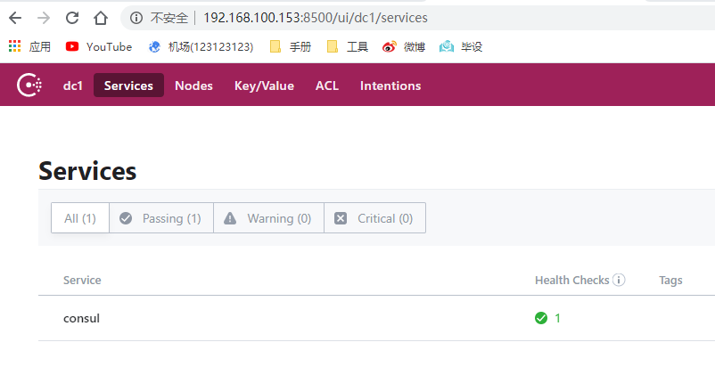

>consul在启动之后就会开放相应的8500的端口我们可以通过程序连接这个端口操作，也可以通过这个访问系统的ui界面
### 3.5 nginx与consul关联配置

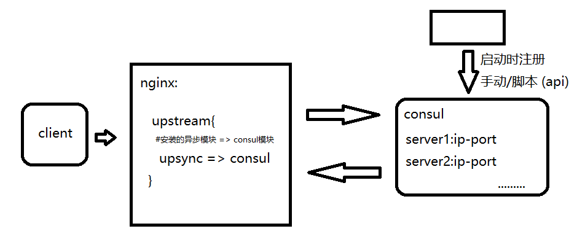

添加的时候要注意名称模块的匹配：
>如下consul是命令参考
>
>curl -X PUT -d '{"weight":1, "max_fails":2, "fail_timeout":10}' http://$consul_ip:$port/v1/kv/$dir1/$upstream_name/$backend_ip:$backend_port
````
[root@localhost ~]# curl -X PUT -d '{"max_fails":2,"fail_timeout":10}' http://127.0.0.1:8500/v1/kv/upstreams/swoole_test/192.168.100.138:9501
true

# 标识 - upstreams
#      - swoole_test
# 服务信息 - 192.168.100.138:9501
# key = upstreams/swoole_test/192.168.100.138:9501
# value = '{"max_fails":2,"fail_timeout":10}'
# 
````
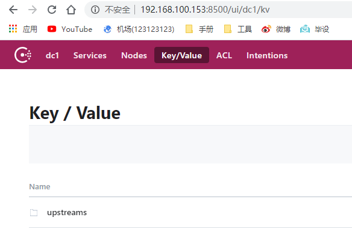
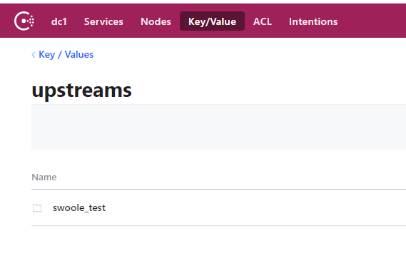
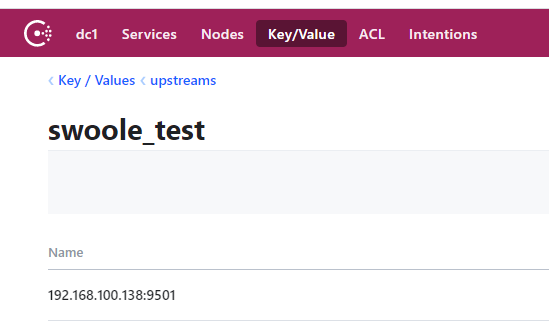
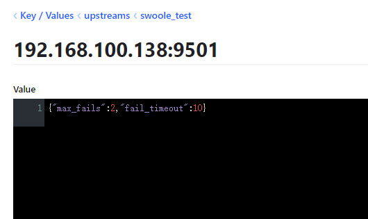
````
继续添加:

[root@localhost ~]# curl -X PUT -d '{"max_fails":2,"fail_timeout":10}' http://127.0.0.1:8500/v1/kv/upstreams/swoole_consul/192.168.100.138:9502
true
````
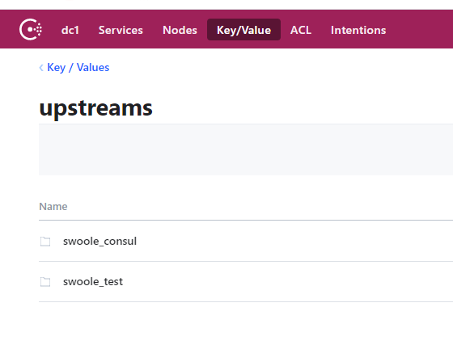

#### 查看所有已经存储的key/value ``curl http://127.0.0.1:8500/v1/kv/?recurse``
````
[root@localhost ~]# curl http://127.0.0.1:8500/v1/kv/?recurse
[
    {"LockIndex":0,"Key":"upstreams/swoole_consul/192.168.100.138:9502","Flags":0,"Value":"eyJtYXhfZmFpbHMiOjIsImZhaWxfdGltZW91dCI6MTB9","CreateIndex":79,"ModifyIndex":79},
    {"LockIndex":0,"Key":"upstreams/swoole_test/192.168.100.138:9501","Flags":0,"Value":"eyJtYXhfZmFpbHMiOjIsImZhaWxfdGltZW91dCI6MTB9","CreateIndex":52,"ModifyIndex":52}
]
````
#### 界面删除:
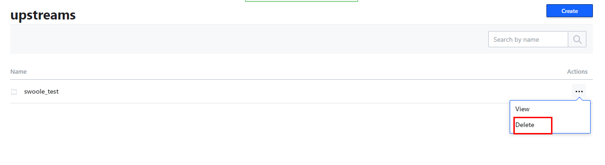


>在nginx中我们可以通过如下配置进行对consul的关联
````
upstream swoole_consul {
    server 192.168.100.138:9501;
    # 通过nginx中的异步模块upsync访问consul , 超时时间时6分钟
    upsync 127.0.0.1:8500/v1/kv/upstreams/swoole_test upsync_timeout=6m 
    # 500ms定时的进行请求 , 类型时consul , 是否关联运行
    upsync_interval=500ms upsync_type=consul strong_dependency=on;
    #生成配置文件 
    upsync_dump_path /usr/local/nginx/conf/servers_test.conf;
    include /usr/local/nginx/conf/servers_test.conf;
}


解释：
127.0.0.1:8500/v1/kv/upstreams =》 连接consul的api资源地址
swoole_test =》 相当于我们自己在consul中自定义的key
upsync_timeout =》 超时时间6分钟 
upsync_interval =》 定时获取信息的时间
upsync_type =》 类型
strong_dependency=on; =》 是否依赖consul运行
upsync_dump_path =》 拉取之后申请配置文件
````
测试:
````
[root@localhost conf]# nginx -s reload
nginx: [emerg] open() "/usr/local/nginx/conf/servers_test.conf" failed (2: No such file or directory) 
in /usr/local/nginx/conf/nginx.conf:33


解决办法:
因为没有servers_test.conf这个文件,所以我们创建一个空的文件
[root@localhost conf]# touch servers_test.conf
````
````
[root@localhost conf]# nginx -s reload

[root@localhost conf]# cat servers_test.conf
server 192.168.100.138:9501 weight=1 max_fails=2 fail_timeout=10s;
````
此时访问(无论怎么刷新):


通过命令动态新增服务:
````
[root@localhost conf]# curl -X PUT -d '{"max_fails":2,"fail_timeout":10}' http://127.0.0.1:8500/v1/kv/upstreams/swoole_test/192.168.100.138:9502
true
````
第一次刷新


第二次刷新


完整的配置文件
````
worker_processes  2;
worker_cpu_affinity auto;  #自动绑定cpu跟进程的关系
events {
    worker_connections  1024;
}


http {
    include       mime.types;
    default_type  application/octet-stream;
    limit_conn_zone $binary_remote_addr zone=addr:10m;
    limit_req_zone $limit_ip zone=one:10m rate=20r/s;
    #设置404页面
    proxy_intercept_errors on;   #http全局块
    sendfile        on;

    geo $svip {
         default         1;
         192.168.100.146  0;
       }
    map $svip $limit_ip {
        1 $remote_addr;
        0 "";
    }
    #负载均衡
   upstream swoole_php {
       server 192.168.100.138:9501;
       # 通过nginx中的异步模块upsync访问consul , 超时时间时6分钟
       upsync 127.0.0.1:8500/v1/kv/upstreams/swoole_test upsync_timeout=6m
       # 500ms定时的进行请求 , 类型时consul , 是否关联运行
       upsync_interval=500ms upsync_type=consul strong_dependency=on;
       #生成配置文件
       upsync_dump_path /usr/local/nginx/conf/servers_test.conf;
       include /usr/local/nginx/conf/servers_test.conf;
   }
    keepalive_timeout  65;
    server {
        listen        80;
        server_name  localhost;
        root              /php;

         # 动态负载均衡
         location /swoole_php {
            # return 200 $key;
             proxy_pass http://swoole_php;
         }
        # ip访问
         location /ip {
            default_type text/html;
           return  200   $limit_ip;
          }

          # nginx图片防盗链
         location ~ .*\.(gif|jpg|jpeg|png|bmp|swf)$ {
                  valid_referers  192.168.100.146  192.168.100.1;
                         if ($invalid_referer){
                                return  403 'u are forbidan';
                         }
                  }

        # 主页面
        location / {
          #proxy_pass http://192.168.100.138:9501/;
          #index index.php index.html index.htm;
          #limit_conn addr 1;
          autoindex on;
          #limit_rate 1k; #限速为 10KB/秒
          #imit_req zone=one burst=5 nodelay;
        }


        # 自定义404页面
        error_page  404  /404.html;
        location = /404.html {
          root html;  
        }

        # redirect server error pages to the static page /50x.html
        error_page   500 502 503 504  /50x.html;
        location = /50x.html {
            root   html;
        }

         # php页面的访问
         location ~ \.php$ {

                fastcgi_pass unix:/tmp/php-cgi-73.sock;

                fastcgi_index index.php;

                fastcgi_param SCRIPT_FILENAME $document_root$fastcgi_script_name;

                include fastcgi_params;
        }
    }
}
````

