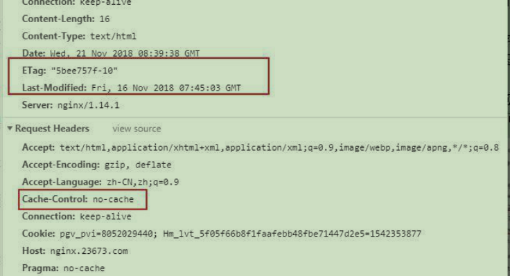
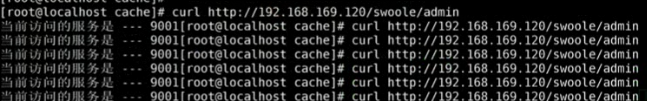

# nginx缓存机制
## 1.关于consul与nginx的结合使用的执行流程

````
consul(consul.php):

<?php
$http = new Swoole\Http\Server("0.0.0.0", 8500);

// 设置swoole进程个数
$http->set([
    'worker_num' => 1
]);

//设置worker进程,使用之前构建的docker镜像中的redis进行存储和发放信息
$http->on('workerStart', function ($server, $worker_id) {
    global $redis;
    $redis = new redis();
    $redis ->connect('127.0.0.1',6379);

});

$http->on('request', function ($request, $response) {
    global $redis;
    $key = $request->get['key'];
    if ($request->get['type'] == 'reg') {
        # 服务发送的那么注册
        $server_info = $request->get['server_info'];
        $redis->sAdd($key,$server_info);
        $response->end('已获取信息');
    } else if($request->get['type'] == 'get'){
       // var_dump($redis->smembers($key));
        $response->end(json_encode($redis->smembers($key)));
    }

});

$http->start();
````
````
服务端(server.php):

<?php
$http = new Swoole\Http\Server("0.0.0.0", 9001);
$key = "server_consul";
// 设置swoole进程个数
$http->set([
'worker_num' => 1
]);

$http->on('workerStart', function ($server, $worker_id) use($key){
    $url = "http://192.168.100.153:8500?key=$key&type=reg&server_info=".json_encode([
        'ip' => '192.168.100.153',
        'port'=> 9001
    ]);

    $ch = curl_init($url);
    curl_exec($ch);
    curl_close($ch);
});

$http->on('request', function ($request, $response) {
   $response->end(9001);
});

$http->start();
````
````
nginx端(nginx.php):

<?php
$file_path = "/usr/local/nginx/conf/server_consul.conf";
$key = "server_consul";

//使用swoole定时器定时检测数据库内容
swoole_timer_tick(2000, function($timer_id) use ($file_path, $key){
    $url = "http://192.168.100.153:8500?key=$key&type=get";
    $ch = curl_init($url);

    curl_setopt($ch, CURLOPT_URL, $url);

    curl_setopt($ch, CURLOPT_SSL_VERIFYPEER, false);

    curl_setopt($ch, CURLOPT_SSL_VERIFYHOST, false);

    curl_setopt($ch, CURLOPT_RETURNTRANSFER, 1);


    //输出信息
    $return = curl_exec($ch);
    curl_close($ch);
    echo  $return;

    //将信息放置在配置文件中
    file_put_contents($file_path, $return);
});
````


## 2.了解缓存
### 2.1 什么是缓存？
>Web缓存是可以自动保存常见文档副本的HTTP 设备。当Web请求抵达缓存时，如果本地有“已缓存的”副本，就可以从本地设备而不是服务器中提取这个文
### 2.2 为什么使用缓存？
- 缓存减少了冗余的数据传输，节约了网络费用
- 缓存缓解了网络瓶颈的问题，对于带宽的要求
- 缓存降低了对原始服务器的要求，降低服务器压力
- 缓存加速了页面的展示
### 2.3 缓存的分类
缓存分为服务端侧（比如 Nginx,redis,memcached）和客户端侧（比如 web browser）。

服务端缓存又分为 代理服务器缓存 和 反向代理服务器缓存（也叫网关缓存，比如 Nginx反向代理就可以设置缓存）

客户端侧缓存一般指的是浏览器缓存、app缓存等等，目的就是加速各种静态资源的访问，降低服务器压力。

## 3.浏览器的缓存


第一次访问:



第二次访问:


### 3.1 HTTP 缓存控制头介绍
HTTP 中最基本的缓存机制，涉及到的 HTTP 头字段，包括 ``Cache-Control``, ``Last-Modified``, ``If-Modified-Since``, ``Etag``, ``If-None-Match`` 等

Last-Modified/If-Modified-Since

``Last-Modified``：标示这个响应资源的最后修改时间。web服务器在响应请求时，告诉浏览器资源的最后修改时间

``If-Modified-Since``：当资源过期时（使用Cache-Control标识的max-age），发现资源具有 Last-Modified 声明，则再次向web服务器请求时带上头

``If-Modified-Since ``，表示请求时间。web服务器收到请求后发现有头 If-Modified-Since 则与被请求资源的最后修改时间进行比对。若最后修改时间较新，说明资源有被改动过，则响应整片资源内容（写在响应消息包体内），HTTP 200；若最后修改时间较旧，说明资源无新修改，则响应 HTTP 304 (无需包体，节省浏览)，告知浏览器继续使用所保存的 cache 


测试:
````
配置文件:

worker_processes 2;
worker_priority -15; #woker进程优先级
error_log /redis_2004/logs/error.log;
events {
    worker_connections 100000; #设置单个worker连接数
}

http {
    sendfile on;
    keepalive_timeout 65;
    server {
        listen 80;
        server_name localhost;
        root /php;
        location / {
            default_type text/html;
            autoindex on;
        }
    }
}
````


我们可以看到在 ``Status Code`` 状态是 ``304 Not Modified``,因为对于浏览器来说 If-Modified-Since: Fri, 19 Jun 2020 20:58:08 GMT检测文件没有发生改变;
我们可以对文件进行改变发型就是200的状态

### 3.2 HTTP Etag   
``Etag`` ：web服务器响应请求时，告诉浏览器当前资源在服务器的唯一标识（生成规则由服务器决定),如果给定URL中的资源修改，则一定要生成新的Etag值。

   

``If-None-Match`` ：当资源过期时（使用Cache-Control标识的max-age），发现资源具有Etage声明，则再次向web服务器请求时带上头 If-None-Match(Etag的
值)。web服务器收到请求后发现有头 If-None-Match 则与被请求资源的相应校验串进行比对，决定返回200或304。

Etag 是啥：
>Last-Modified 标注的最后修改只能精确到秒级，如果某些文件在1秒钟以内，被修改多次的话，它将不能准确标注文件的修改如果某些文件会被定期生成，当有时内容并没有任何变化，但 Last-Modified 却改变了，导致文件没法使用缓存
>
>有可能存在服务器没有准确获取文件修改时间，或者与代理服务器时间不一致等情形 Etag是服务器自动生成或者由开发者生成的对应资源在服务器端的唯一标识
 符，能够更加准确的控制缓存。 Last-Modified 与 ETag 是可以一起使用的，服务器会优先验证 ETag ，一致的情况下，才会继续比对 Last-Modified ，最后才决
 定是否返回304。


浏览器第二次请求


### 3.3 Nginx web缓存设置
一般针对于图片等
>nginx 提供了 ``expires``、``etag``、``if-modified-since`` 指令来进行浏览器缓存控制。


#### 3.3.1 设置(取消)静态资源的缓存
````
add_header Cache-Control "private, no-store, no-cache, must-revalidate, proxy-revalidate";
add_header Pragma no-cache;
add_header Expires 0;
````
````
worker_processes  2;
events {
    worker_connections  100000; #设置单个worker连接数
}
http {
    default_type  application/octet-stream;
    sendfile        on;
    keepalive_timeout  65;

    server {
        listen       80;
        server_name  localhost;
        root /php;

        location / {
            autoindex on;
            add_header Cache-Control "no-cache, no-store";
            add_header Pragma no-cache;
            add_header Expires 0;
        }
    }
}
````
##### 刷新第一次

##### 刷新第二次


## 4. [ngx_http_proxy_module模块](https://tengine.taobao.org/nginx_docs/cn/docs/http/ngx_http_proxy_module.html)
>``Proxy 模块``，用于把请求后抛给服务器节点或 upstream 服务器池

请求头传递
````
proxy_redirect off ;
proxy_set_header Host $host;
proxy_set_header X-Real-IP $remote_addr;
proxy_set_header REMOTE-HOST $remote_addr;
proxy_set_header X-Forwarded-For $proxy_add_x_forwarded_for;
client_max_body_size 50m;
client_body_buffer_size 256k;
proxy_connect_timeout 30;
proxy_send_timeout 30;
proxy_read_timeout 60;
proxy_buffer_size 256k;
proxy_buffers 4 256k;
proxy_busy_buffers_size 256k;
proxy_temp_file_write_size 256k;
proxy_max_temp_file_size 128m;
proxy_pass http://nginx.23673.com;
````
### 4.1 proxy_cache_path指令


测试:
````
worker_processes 2;
worker_priority -15; #woker进程优先级
events {
    worker_connections 100000; #设置单个worker连接数
}

http {
    sendfile on;
    keepalive_timeout 65;

    # 设置缓存目录
    proxy_cache_path /php/cache levels=1:2 keys_zone=test:1m max_size=2m;

    server {
    listen 80;
    server_name localhost;
    root /php;
        location / {
            default_type text/html;
            autoindex on;
        }
    }
}
````
但是这样测试对于客户端没有任何效果，因为代理的是服务器,另外还需要额外设置额外参数
>``proxy_cache_valid``: 为不同的HTTP返回状态码的资源设置不同的缓存


对应配置
````
worker_processes 2;
worker_priority -15; #woker进程优先级
events {
    worker_connections 100000; #设置单个worker连接数
}

http {
    sendfile on;
    keepalive_timeout 65;

    # 设置缓存目录
    #proxy_cache_path /php/cache levels=1:2 keys_zone=test:1m max_size=2m;
    proxy_cache_path /php/cache levels=1:2 keys_zone=mycache:1m max_size=2m;
    upstream swoole_server {
        server 192.168.100.153:9001;
        server 192.168.100.153:9002;
    }

    server {
    listen 80;
    server_name localhost;
    root /php;

        location /swoole {
            proxy_cache mycache;
            proxy_cache_valid any 1m; # 指定缓存的类型和大小
            proxy_pass http://swoole_server;
        }
    }
}
````


##### 并且会生成一个缓存文件(缓存文件不会立即生效,稍等一下)

````
[root@localhost 89]# cat 57e85fe2a66cd0aa45ad503f5b01a89f

KEY: http://swoole_php/swoole_php
HTTP/1.1 200 OK
Content-Type: text/html; charset=utf-8
Server: swoole-http-server
Connection: close
Date: Fri, 19 Jun 2020 21:51:09 GMT
Content-Length: 47
Content-Encoding: gzip
````
## 4.2 
### 4.2.1 缓存细节
>NGINX仅仅默认缓存``GET``和``HEAD``客户端请求，在响应头部中 ``Cache-Control`` 被配置为 Private，No-Cache，No-Store 或者 Set-Cookie ， NGINX 不会进行缓存.
>
>类似我们在框架中的header方法
>
>如果你不想源服务器控制是否缓存，也可以在 nginx 当中配置忽略利用``proxy_ignore_headers Cache-Control``指令实现

下面的指令允许多种请求类型缓存``proxy_cache_methods GET HEAD POST``

演示:
````
location /swoole {
    proxy_cache mycache;
    proxy_cache_valid any 1m;
    #proxy_ignore_headers Cache-Control; # 忽略服务器不缓存请求
    proxy_cache_methods GET HEAD POST;  # 指定缓存的类型
    proxy_pass http://swoole_server;
}
````
### 4.2.2 缓存设置优化
``proxy_cache_min_uses`` 设置响应被缓存的最小请求次数
>当缓存不断被填满时，这项设置便十分有用，因为这确保了只有那些被经常访问的内容才会被添加到缓存中。该项默认值为1。

``proxy_cache_lock`` 开启此功能时，对于相同的请求，同时只允许一个请求发往后端。
>只有这些请求中的第一个被允许发送至服务器。其他请求在第一个请求得到满意结果之后在缓存中得到文件。如果不启用 proxy_cache_lock ，则所有在缓存中找
 不到文件的请求都会直接与源服务器通信。
 
### 4.2.3 不缓存的条件
>有时候，我们也不想所有的请求都被缓存，我们可以指定某些请求不被缓存，比如带有后台后缀的，可以通过一些条件判断决定是否缓


比如后台模块是不允许缓存的，就可以设置不缓存
- 原因：比如我们后台在调整的时候需要及时看到资源的变化
- 思路：我们可以利用之前的map做操作
````
http {
  ## ..

    map $request_uri $no_cache {
        default  0;
        ~*/admin 1;
    }

    server {
        ## ..
        location /test {
         return 200 $no_cache;
        }
    }
}
````


进行完善:
````
http {
    ## ..
        map $request_uri $no_cache {
            default 0;
            ~*/admin 1;
        }

    upstream swoole_server {
        server 192.168.100.153:9001;
    }
    server {
    ## ..
        location /swoole {
            proxy_cache_bypass $no_cache;
            proxy_pass http://swoole_server;
        }
    }
}
````
````
swoole服务:

<?php
$http = new Swoole\Http\Server("0.0.0.0", 9001);
$http->set([
    'worker_num' => 1,
]);

$http->on("request", function ($request, $response) {
    var_dump('1');
    $response->end("当前访问的服务是 --- 9001");
});

$http->start();
?>
````
#### 请求swoole服务时,``拥有缓存设置``:


>只有第一次访问服务端,其他的都请求了缓存
#### 请求swoole服务(admin后天模块)时,``没有缓存设置``:




>每一次的请求都会走服务端

### 4.2.4 清除缓存
>某些时候我们如果不想等待缓存的过期，想要主动清除缓存，可以采用第三方的缓存清除模块清除缓存 ``nginx_ngx_cache_purge``
- [第三方地址](https://www.nginx.com/resources/wiki/modules/) 
- [Purge 模块下载地址](http://labs.frickle.com/nginx_ngx_cache_purge/) 
````
可以利用平滑升级的方式安装
proxy_cache_purge
syntax: proxy_cache_purge zone_name k
default: none
context: locati
````


首先我们可以根据特定的方式指定缓存文件的key，比如根据路径 ``proxy_cache_key $uri$is_args$args``;
````
http {
# ...
    # 设置缓存目录
    proxy_cache_path /redis_2004/cache levels=1:2 keys_zone=mycache:1m max_size=2m;

# ...
    map $request_uri $no_cache {
    default 0;
    ~*/admin 1;
    }

    server {
        # ...
        location /swoole {
            proxy_cache mycache;
            proxy_cache_valid any 1m;
            proxy_ignore_headers Cache-Control; # 忽略服务器不缓存请求
            proxy_cache_methods GET HEAD POST;
            proxy_cache_bypass $no_cache;
            proxy_pass http://swoole_server;

            proxy_cache_key $uri$is_args$args; # 设置缓存的key； url跟参数生成的key
        }

        location ~/purge(/.*) {
            #return 200 '$1$is_args$args'; # $1 就是 purge(/.*) 中的参数
            proxy_cache_purge my_cache $1$is_args$args; # 设置缓存的key
        }
    # ...
    }
}
````