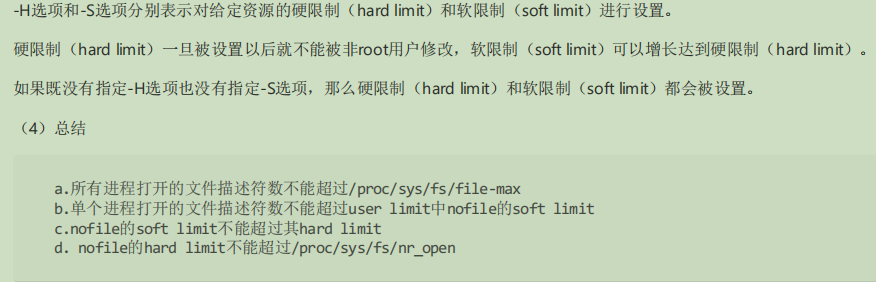
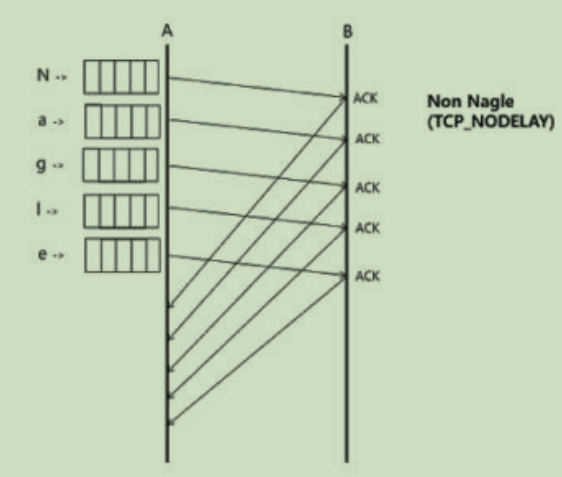
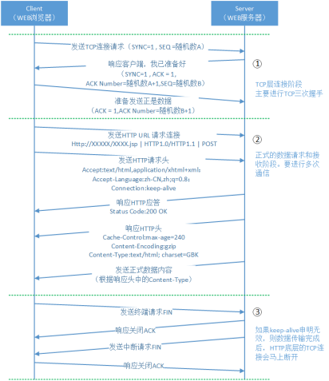
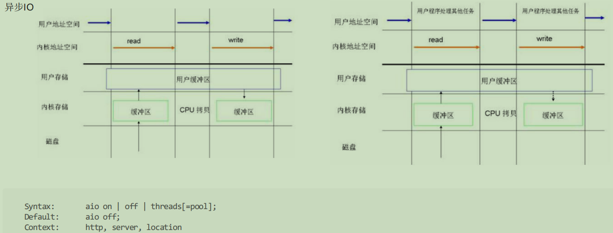

# 网络与io优化
## 1.优化方法论
从软件层面提升硬件使用效率
- 增大CPU的利用率
- 增大内存的利用率
- 增大磁盘10的利用率
- 增大网络带宽的利用率
 
 提升硬件规格
- 网卡：万兆网卡，例如10G、25G、40G等
- 磁盘:固态硬盘
- CPU :更快的主频，更多的核心，更大的缓存,更优的架构
- 内存：更快的访问
---

## 2、Nginx相关优化配置-进程
### 2.1、如何增大Nginx使用CPU的有效
 能够使用全部CPU
 - master-worker多进程架构 : ``worker进程数量应当大于等于CPU核数``
 
Nginx进程间不做无用功浪费CPU
- worker进程不应在繁忙时，主动让出CPU
- worker进程间不应由于争抢造成资源耗散
- worker进程数量应当等于CPU核数
- worker进程不应调用一些API导致主动让出CPU : 比如使用openresty调用第三方模块

不被其他进程争抢资源
- 提升优先级占用CPU更长的时间
- 减少操作系统上耗资源的非Nginx 
 
 设置worker进程的数量
 >通过合理的设置worker的进程数量，提高cpu利用率,cpu设置等于或者小于核数

查看cpu核数的方法 ``grep "processor" /proc/cpuinfo |wc -l``或者``lscpu | grep "CPU(s)"``
````
[root@localhost ~]# grep "processor" /proc/cpuinfo |wc -l
1
-------------------------------------------------------------
[root@localhost ~]# lscpu | grep "CPU(s)"
CPU(s):                1
On-line CPU(s) list:   0
NUMA node0 CPU(s):     0
````

为何一个CPU就可以同时运行多个进程?
- 宏观上并行，微观上串行
- 把进程的运行时间分为一段段的时间片
- OS调度系统依次选择每个进程，最多执行时间片指定的时长

- 阻塞API引发的时间片内主动让出CPU
-速度不一致引发的阻塞API
-硬件执行速度不一致，例如CPU和磁盘
- 业务场景产生的阻塞API : 例如同步读网络

### 2.2 减入进程间切换
何为进程间切换?
>是指CPU从一个进程或线程切换到另一个进程或线程

类别
- 主动切换
- 被动切换：时间片耗尽
>减少被动切换,增大进程优先级

#### 2.2.1 减入被动进程间切换的配置-设置worker进程优先级

````
增大worker进程的时间片，通过设置优先级赖减入被动切换

什么决定CPU时间片的大小?
    在默认情况下，最小时间片是5ms，最大则有800ms
    进程分配的CPU时间片大小也与优先级有关，优先级越高，时间片越长

    Nice静态优先级：-20 - 19 静态优先级越小越不友好则时间片越长，可以通过top程序看到
        设置worker进程的静态优先级
        Syntax: worker_priority number;
        Default: worker_priority 0;
        Context: main
````
#### 2.2.2 减入被动进程间切换的配置-为进程绑定cpu
>nginx默认是没有开启利用多核cpu的配置的。需要通过增加worker_cpu_affinity配置参数来充分利用多核cpu

当CPU在运行的时候，如果一颗CPU始终固定的去运行同一个进程，当用户连接到进程的时候，用固定的CPU响应用户的请求，CPU中有缓存，就可以重复的使用CPU中缓存的数据。如果进程一开始运行在第一颗CPU上，运行一会跑到第二颗CPU上，就意味着原来的缓存信息在第二颗CPU上无法使用，还需要重新加载，带来资源的浪费，影响效率
````
绑定Nginx worker进程到指定的CPU内核
    Syntax: worker_cpu_affinity cpumask
        worker_cpu_affinity auto [cpumask];
    Default: -;
    Context: main
````

### 2.3 Nginx 事件处理模型
>Nginx 的连接处理机制在不同的操作系统中会采用不同的 I/O 模型，在 linux 下，Nginx 使用 epoll 的 I/O 多路复用模型，在 Freebsd 中使用 kqueue 的 I/O 多路复用模型 不过这个选项没必要设置，因为nginx会自动选择最有效的方法作为默认项
````
Syntax: use method;
Default: —
Context: events
````
### 2.4 单个进程允许的客户端最大连
>通过调整控制连接数的参数来调整 Nginx 单个进程允许的客户端最大连接数,更多的worker的connection数量对会占用更多的内存，一般一个connection约232字节，而且event也约96字节，一个连接就是232+96*2
````
Syntax: worker_connections number;
Default: 1024
Context: events
````
### 2.5 配置Nginx worker进程最大打开文件数
````
Syntax: worker_rlimit_nofile number;
Default: -
Context: events
````

### 2.6 修改用户的最大文件句柄数限制
临时修改 ``ulimit -HSn limit``
永久修改 ``vi /etc/security/limits.conf``



## 3.Nginx相关优化配置-网络相关
什么是SYN攻击？
>攻击者短时间``伪造不同IP地址的SYN报文``，``快速占满backlog队列``，使服务器不能为正常用户服务，SYN攻击是所有黑客攻击事件中最常见又最容易被利用的一种攻击手法，由来已久，破坏威力巨大。``SYN攻击属于DOS攻击的一种``， 它利用TCP协议缺陷，通过``发送大量的半连接请求``，``耗费CPU和内存资源``

TCP连接握手示意图


SYN_SENT 状态
````
• net.ipv4.tcp_syn_retries = 6
    -主动建立连接时，发SYN的重试次数
• net.ipv4.ip_local_port_range = 32768 60999
    -建立连接时本地口可用范围
````
SYN_RCVD 状态
````
net.ipv4.tcp_max_syn_backlog
    -SYN_RCVD状态连接的最大数
net.ipv4.tcp_synack_retries
    -被动建立连接时，发SYN/ACK的重试次数
````


这些配置可以在Linux系统中添加,添加位置在``/etc``下的``sysctl.conf``文件
````
[root@localhost etc]# pwd
/etc

[root@localhost etc]# ll | grep sysctl
-rw-r--r--.  1 root root      449 Aug  4  2017 sysctl.conf
drwxr-xr-x.  2 root root     4096 Feb 13 01:06 sysctl.d


//默认没有任何添加的内容
[root@localhost etc]# vim sysctl.conf 
# sysctl settings are defined through files in
# /usr/lib/sysctl.d/, /run/sysctl.d/, and /etc/sysctl.d/.
#
# Vendors settings live in /usr/lib/sysctl.d/.
# To override a whole file, create a new file with the same in
# /etc/sysctl.d/ and put new settings there. To override
# only specific settings, add a file with a lexically later
# name in /etc/sysctl.d/ and put new settings there.
#
# For more information, see sysctl.conf(5) and sysctl.d(5).


[root@localhost sysctl.d]# pwd
/etc/sysctl.d

[root@localhost sysctl.d]# ll
total 0
lrwxrwxrwx. 1 root root 14 Feb 13 01:06 99-sysctl.conf -> ../sysctl.conf

[root@localhost sysctl.d]# vim 99-sysctl.conf 
# sysctl settings are defined through files in
# /usr/lib/sysctl.d/, /run/sysctl.d/, and /etc/sysctl.d/.
#
# Vendors settings live in /usr/lib/sysctl.d/.
# To override a whole file, create a new file with the same in
# /etc/sysctl.d/ and put new settings there. To override
# only specific settings, add a file with a lexically later
# name in /etc/sysctl.d/ and put new settings there.
#
# For more information, see sysctl.conf(5) and sysctl.d(5).

````


#### 如何应对SYN攻击？
>SYN攻击的原理就是向服务器发送SYN数据包，并伪造源IP地址。服务器在收到SYN数据包时，会将连接加入backlog队列，并向源IP发送SYN-ACK数据包，并等待ACK数据包，以完成三次握手建立连接。 由于源IP地址是伪造的不存在主机IP，所以服务器无法收到ACK数据包，并会不断重发，同时backlog队列被不断被攻击的SYN连接占满，导致无法处理正常的连接小号cpu资源。


1、减少SYN-ACK数据包的重发次数（默认是5次）
````
sysctl -w net.ipv4.tcp_synack_retries=3
sysctl -w net.ipv4.tcp_syn_retries=3
````
2、增大backlog队列（默认是1024）
````
• net.core.netdev_max_backlog
    -接收自网卡、但未被内核协议栈处理的报文队列长度
• net.ipv4.tcp_max_syn_backlog
    -SYN_RCVD状态连接的最大个数

sysctl -w net.ipv4.tcp_max_syn_backlog=2048
````


3、超出处理能力时，对新来的SYN丢弃连接
````
• net.ipv4.tcp_abort_on_overflow
````
>以上参数为文件默认自带，如果对参数进行修改可以使用 ``/sbin/sysctl -p``命令让配置立即生效。如果需要配置其他内核参数请查看 ``/proc/sys``目录，此目录存放着所有的内核参数，直接修改此目录的值会在重启机器时失效，通过将参数添加到``/etc/sysctl.conf``中使参数修改永久生效。


4、生成验证cookie，重连(类似于[csrf](https://baike.baidu.com/item/%E8%B7%A8%E7%AB%99%E8%AF%B7%E6%B1%82%E4%BC%AA%E9%80%A0/13777878?fromtitle=CSRF&fromid=2735433&fr=aladdin))
````
• net.ipv4.tcp_syncookies = 1
    -当SYN队列满后,新的SYN不进A队列,计算出cookie再以SYN+ACK中的序列号返回客户端，正常客户端发报文时,服务端根据报文中携带的cookie重新恢复连接
`````


>注意：synccookies是妥协版的TCP协议，失去了很多功能，所以先应优化服务端应用程序的负载能力，加大应用程序 backlog值

## *4.[Nagle算法](https://baike.baidu.com/item/Nagle%E7%AE%97%E6%B3%95/5645172?fr=aladdin)
- 避免一个连接上同时存在大量小报文,最多只存在要给小报文,合并多个小报文一起发送
- 提高带宽利用率
````
吞吐量优先：启用Nagle算法,tcp_nodelay off
低时延优先：禁用Nagle算法,tcp_nodelay on
````



## 5. Nginx中Gzip指令
#### [ngx_http_gzip_module](https://tengine.taobao.org/nginx_docs/cn/docs/http/ngx_http_gzip_module.html)
>nginx中gzip的主要作用就是用来减轻服务器的带宽问题，经过gzip压缩后的页面大小可以变为原来的30%甚至更小，这样用户浏览页面时的速度会快很多。gzip的压缩页面需要浏览器和服务器双方都支持，实际上就是服务器端压缩，传到浏览器后浏览器解压缩并解析。目前的大多数浏览器都支持解析gzip压缩过的页面,``nginx默认开启了gzip压缩``


##### 响应头响应浏览器使用gzip


##### 参数:


##### 这里准备了一个``1.7MB``的 html文件


添加配置
````
gzip on ;
gzip_comp_level 6;
gzip_min_length 1024;
````


#### gzip_types可以指定压缩的类型,通过查看``/usr/local/nginx/conf/mime.types``查看所有的类型
>不要指定``text/html``会报错,因为默认就是这个类型
````
[root@localhost conf]# pwd
/usr/local/nginx/conf
[root@localhost conf]# cat mime.types

types {
    text/html                             html htm shtml;
    text/css                              css;
    text/xml                              xml;
    image/gif                             gif;
    image/jpeg                            jpeg jpg;
    application/javascript                js;
    application/atom+xml                  atom;
    application/rss+xml                   rss;       
                                                    ..................
````

#### 压缩的过程

- 整个请求过程来看，开启gzip和不开启gip功能，其http的请求和返回过程是一致的，不同的是参数。
- 当开启HTTP的gzip功能时，客户端发出http请求时，会通过headers中的Accept-Encoding属性告诉服务器“我支持gzip解压，解压格式（算法）deflate,sdch为：”。Accept-Encoding:gzip,deflate,sdch
- 注意，不是request说自己支持解压，Nginx返回response数据的时候就一定会压缩。这还要看本次Nginx返回数据的格式是什么，如果返回数据的原始数据格式，和设置的gzip_types相符合，这时Nginx才会进行压缩。
- Nginx返回response headers是，如果数据被压缩了，就会在Content-Encoding属性中标示gzip，表示接下来返回的response 
- content是经过压缩的；并且在Content-Type属性中表示数据的原始格式。
- 最后返回经过压缩的response content给客户端，客户端再进行解压。这里注意一下，在客户端发送的headers里面，有一个deflate,sdch。这是两种压缩算法

## 6.减少磁盘IO
- 优化读取
- Sendfile 零拷贝
- 内存盘、SSD盘
- 减少写入
- AIO
- 增大 error_log级别
- 关闭 access_log
- 压缩 access_log
- 线程池thread po





