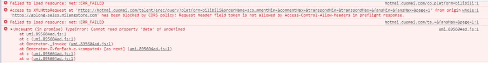
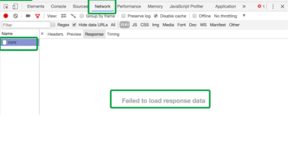

> # 关于https中 安全 跨域 及 k8s 接管代理服务问题
前景: 昨天在项目上线,通过 https://golong-sales.milangstore.com/ 访问 https://remai.duomai.com/
出现了 



这个问题,原因是cors头里没允许暴露token吧,那么开始解决

那么 什么是cors呢? 使用 CORS 解决跨域的问题，前后端要怎么做？为什么这么做？

> ## 什么是同源
协议、域名、端口号完全相同时，才是同源

在同源策略下，会有以下限制：

无法获取非同源的 Cookie、LocalStorage、SessionStorage 等
无法获取非同源的 dom
无法向非同源的服务器发送 ajax 请求

但是我们又经常会遇到前后端分离，不在同一个域名下，需要 ajax 请求数据的情况。那我们就要规避这种限制。
可以在网上搜到很多解决跨域的方法，有些方法比较古老了，现在项目中用的比较多的是 `jsonp` 和 `CORS`（跨域资源共享）
jsonp自行百度搜索

> ## CORS跨域原理
跨源资源共享标准新增了一组 HTTP 首部字段，允许服务器声明哪些源站通过浏览器有权限访问哪些资源,[详情](https://developer.mozilla.org/zh-CN/docs/Web/HTTP/CORS)。另外，规范要求，
对那些可能对服务器数据产生副作用的 HTTP 请求方法（特别是 GET 以外的 HTTP 请求，或者搭配某些 MIME 类型的 POST 请求），
浏览器必须首先使用 OPTIONS 方法发起一个预检请求（preflight request），从而获知服务端是否允许该跨源请求。服务器确认允许之后，才发起实际的 HTTP 请求。
在预检请求的返回中，服务器端也可以通知客户端，是否需要携带身份凭证（包括 Cookies 和 HTTP 认证相关数据）。
CORS请求失败会产生错误，但是为了安全，在JavaScript代码层面是无法获知到底具体是哪里出了问题。你只能查看浏览器的控制台以得知具体是哪里出现了错误。

> ## 没有允许跨域的情况
再来回顾一下问题:




- 1、浏览器请求是发出去了的，服务端也会正确返回，但是我们拿不到response的内容

- 2、浏览器控制台会报错提示可以怎么做，而且提示的很明: 使用 XMLHttpRequest 不允许 https://golong-sales.milangstore.com/ 访问 https://remai.duomai.com/
token字段没有在 Access-Control-Allow-Header 中被允许,那就允许一下好了
> ## nginx配置
````
server {
    listen   80;

    server_name  _;
    root /var/www/html/public;
    index index.html index.htm index.php;

    # access_log  /var/log/nginx/oa.log;
    charset utf-8;

    add_header 'Access-Control-Allow-Origin' "*";
    add_header Access-Control-Allow-Methods "POST, GET, PUT, OPTIONS, DELETE";
    add_header 'Access-Control-Allow-Credentials' true;
    add_header 'Access-Control-Allow-Headers' 'Origin, X-Requested-With, Content-Type, Accept, Authorization,Token,Admin_Token,Platform,Token,X-CSRF-Token';
    add_header P3P "CP=CAO PSA OUR";

    location / {
        if ($request_method = 'OPTIONS') {
                return 204;
        }
        try_files $uri $uri/ /index.php?_url=$uri&$args;

    }

    location ~ \.php$ {
        fastcgi_split_path_info ^(.+\.php)(/.+)$;
        fastcgi_pass  127.0.0.1:9000;
        #fastcgi_pass unix:/var/run/php-fpm.sock;
        fastcgi_index index.php;
        fastcgi_param SCRIPT_FILENAME  $document_root$fastcgi_script_name;
        include       fastcgi_params;
    }
    location = /robots.txt  { access_log off; log_not_found off; }
    location = /favicon.ico { access_log off; log_not_found off; expires 30d; }
    location ~ /\.          { access_log off; log_not_found off; deny all; }
    location ~ ~$           { access_log off; log_not_found off; deny all; }

    location ~ /\.ht {
        deny  all;
    }
}
````
可以允许设置的内容
````
Access-Control-Allow-Origin
Access-Control-Allow-Credentials
Access-Control-Allow-Methods
Access-Control-Allow-Headers
Access-Control-Expose-Headers
Access-Control-Max-Age
#HTTP Request Header
Access-Control-Request-Method
Access-Control-Request-Headers
````
其中主要设置为
````
add_header 'Access-Control-Allow-Origin' "*";
add_header Access-Control-Allow-Methods "POST, GET, PUT, OPTIONS, DELETE";
add_header 'Access-Control-Allow-Credentials' true;
add_header 'Access-Control-Allow-Headers' 'Origin, X-Requested-With, Content-Type, Accept, Authorization,Token,Admin_Token,Platform,Token,X-CSRF-Token';
add_header P3P "CP=CAO PSA OUR";
````
CORS请求默认不发送Cookie和HTTP认证信息。但是如果要把Cookie发到服务器，要服务器同意，指定Access-Control-Allow-Credentials字段。
````
add_header 'Access-Control-Allow-Credentials' 'true';
````
- 1、跨域请求时，浏览器默认不会发送cookie，需要设置XMLHttpRequest的withCredentials属性为true
- 2、 浏览器设置XMLHttpRequest的withCredentials属性为true，表明要向服务端发送凭证信息(这里是cookie)。那么服务端就需要在响应头中添加Access-Control-Allow-Credentials为true。否则浏览器上有两种情况：
- - 如果是简单请求，服务端结果吐出了，浏览器拿到了但就是不给吐出来，并报错。
- - 如果是预检请求，同样我们拿不到返回结果，并报错提示预检请求不通过，不会再发第二次请求。
需要注意的是，如果要发送Cookie，Access-Control-Allow-Origin就不能设为星号，必须指定明确的、与请求网页一致的域名。


此时虽然我们已经添加了所有的Methods方法，但是预检请求仍不会通过，因此此时nginx对OPTIONS方法返回"405 Method Not Allowed”或者403。我们需要在nginx对OPTIONS方法进行处理，如下：
````
if ($request_method = 'OPTIONS') {
	add_header 'Access-Control-Allow-Origin' '*';
	add_header 'Access-Control-Allow-Methods' 'GET, POST, OPTIONS, PUT, DELETE';
	add_header 'Access-Control-Allow-Headers' 'Content-Type';
	return 200;
}
````
- 对于 POST 请求设置响应头Content-Type为某些值、自定义请求头等情况，浏览器会先以OPTIONS方法发送一个预检请求，并设置相应的请求头。
- 服务端还是正常返回，但如果预检请求响应头中不设置相应的响应头，预检请求不通过，不会再发出第二次请求来获取数据。
- 服务端设置相应的响应头，浏览器会发出第二个请求，并将服务端返回的数据吐出，我们可以获得response的内容
> ## k8s 中 [Istio Ingress和Egress详解(解决Istio无法外网访问问题)](https://istio.io/latest/docs/reference/config/networking/virtual-service/#CorsPolicy)
